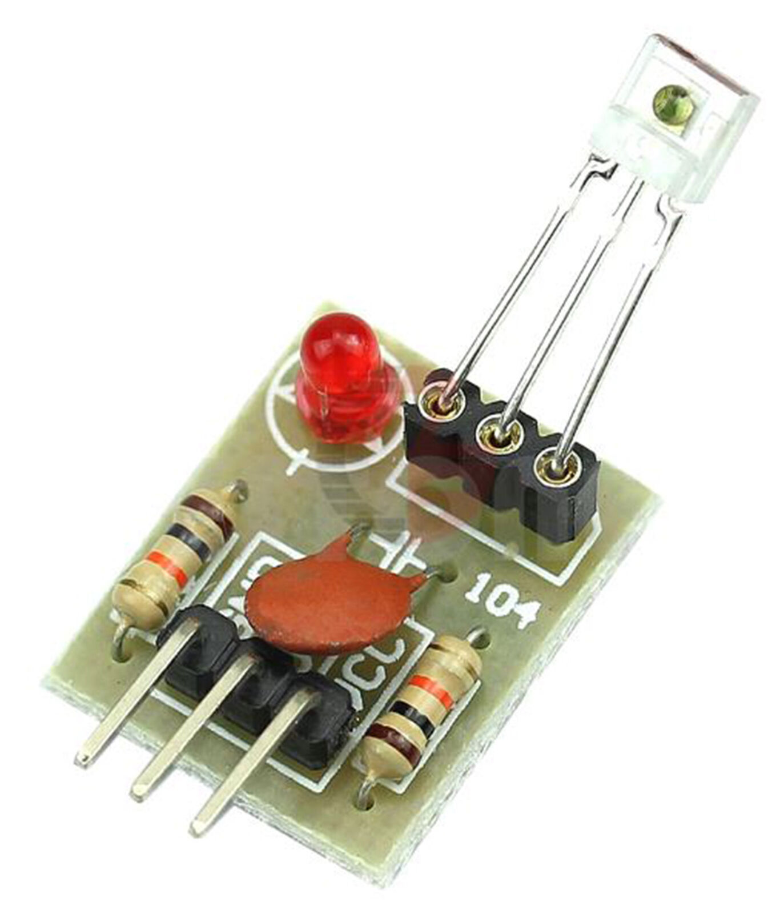
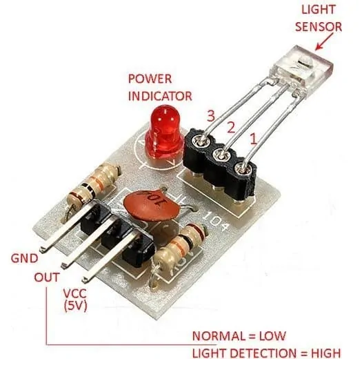
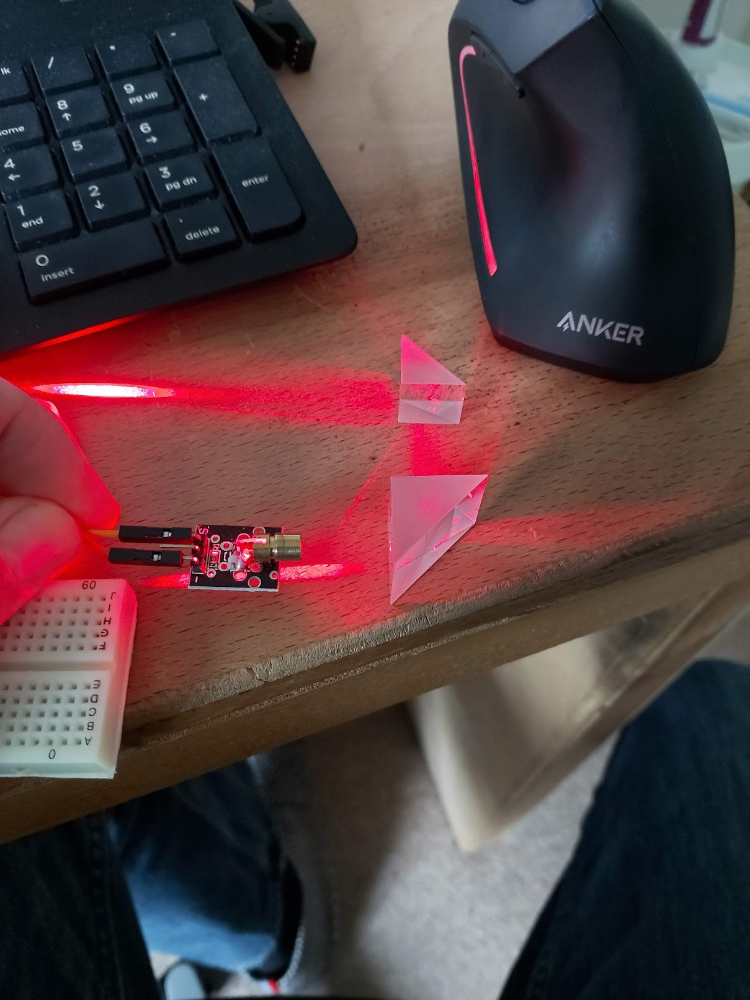

# Mark 3 #

Starting planning the next major redesign of the scanner - planning on going back to optical - but combination optical/mechanical using occlusion not Time Of Flight.

## KY-008 ##

https://arduinomodules.info/ky-008-laser-transmitter-module/

This module consists of a 650nm red laser diode head, a resistor and 3 male header pins. Handle with caution, do not point the laser beam directly to the eyes.

Operating Voltage	5V

Connect the module signal pin (S) to pin 13 on the Arduino and ground (-) to GND.

The middle pin on the module is not used.


## Receiver ##
Laser Receiver Sensor Module non-modulator Tube Pi Arduino Pic Lazer

The laser receiver sensor module uses a non-modulated laser receiver to detect the laser signal.

For use indoors where there is no light, sunlight or other sources of light which will interfere with the sensor, recommended for use in dark environments.


 
Voltage : 5v
Output high level when receive laser signal
Output low level when not receive laser signal
Size : 1.5cm x 1.9cm

https://www.codrey.com/electronic-circuits/the-mysterious-laser-receiver-sensor-module/


```
A cryptic 3-pin sensor?
The 3-pin sensor is actually a minuscule light sensor (receiver) diode with an integrated amplifier and an open-collector transistor at its output. Output of the module, designed to operate on 5VDC power supply, can only go low (L), and the open-collector transistor inside the 3-pin sensor can sink about 20mA current. The description “non-modulator tube” actually points the fact that the light sensor can handle any source of light and it’s not like a 3-pin  infrared sensor module (TSOP1838 for example) that only detects an infrared pulse train within a particular frequency band.

...the sensor is known in China as “ISO203 Laser Receiver”. You can see its pin notation in the image provided below.
```





This is going to be so cool!


https://matplotlib.org/stable/gallery/mplot3d/voxels_rgb.html


After dealing with an issue where the ends of the arms bounce after the beginning and end of the stroke, I could start some calibration scans.


