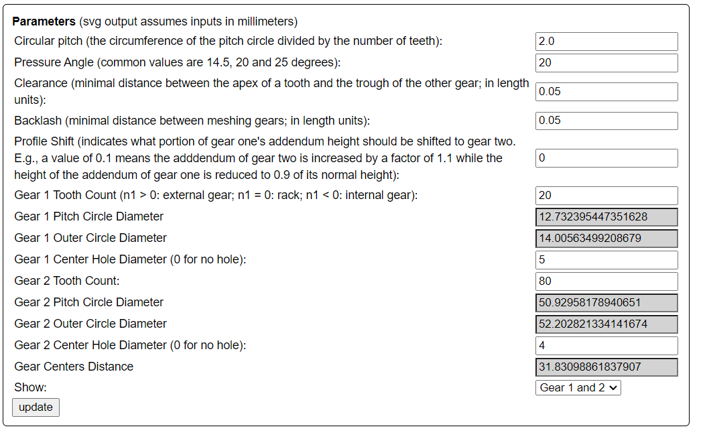
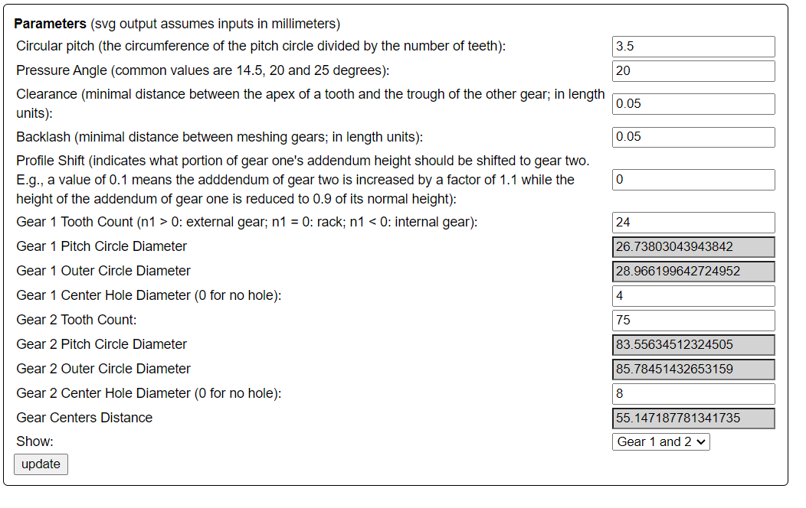
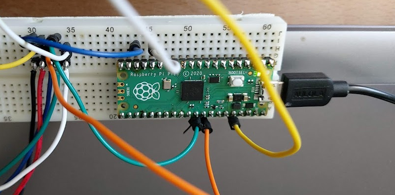
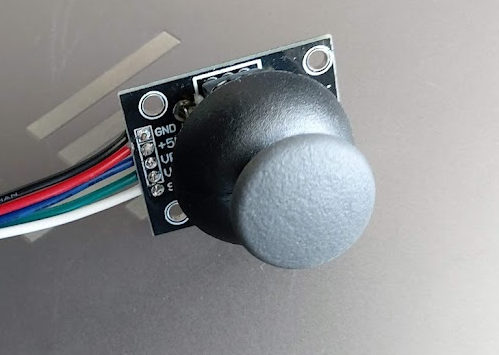

## Gearbox ##
Working out a small gear box for the new table design


http://hessmer.org/gears/InvoluteSpurGearBuilder.html?circularPitch=3.2&pressureAngle=20&clearance=0.05&backlash=0.05&profileShift=0&gear1ToothCount=0&gear1CenterHoleDiamater=4&gear2ToothCount=8&gear2CenterHoleDiamater=4&showOption=3


https://evolventdesign.com/pages/gear-ratio-calculator

Number of Teeth: Input Gear: 20 (16mm diameter)
Number of Teeth: Gear 2:    80 (54mm diameter)
Number of Teeth: Gear 3:    24 (30mm diameter)
Number of Teeth: Gear 4:    75 (80mm diameter)

Gear Ratio:	0.0800

Input Speed:	200
Output Speed:	16.0000

Gears 1 & 2
http://hessmer.org/gears/InvoluteSpurGearBuilder.html?circularPitch=2&pressureAngle=20&clearance=0.05&backlash=0.05&profileShift=0&gear1ToothCount=20&gear1CenterHoleDiamater=5&gear2ToothCount=80&gear2CenterHoleDiamater=4&showOption=3

Gears 3 & 4
http://hessmer.org/gears/InvoluteSpurGearBuilder.html?circularPitch=3.5&pressureAngle=20&clearance=0.05&backlash=0.05&profileShift=0&gear1ToothCount=24&gear1CenterHoleDiamater=4&gear2ToothCount=75&gear2CenterHoleDiamater=8&showOption=3




## Thumbstick ##

I felt like I needed more inputs/controls as I develop the Mk4.

Now that I have more travel, I want to be able to set limits for the scan region (to save time not scanning empty space)

The obvious input formats are up-confirm down-confirm to set the limits of the table (for the height of the part) and left-confirm right confirm to set the limits for the max extent of the part when rotated.

To avoid this input being an awkward series of switch presses, I decided to try and integrate a thumbstick.

The thumbstick from the sensor kit says 5v on the silk screen, but seems to work just fine on 3v3.
It has two analogue outs, which I feed into 26 and 27 (ADC ins on the pico) and a switch which I connect to 22 because it is nearby.

I'm not using the analogue values, only a less than 25% or more than 75% to detect left or right - else it gives no input.




I wired it up on a breadboard with a test sketch - then soldered connectors onto the main pico shield.
22, 26 & 27 were thankfully unused. I also spliced on the power lines to the existing 3v3 and ground rows.

I had a bit of trouble wiring 22,26 & 27 and in the end I didn't get the colouring consistent on the thumbstick end and pico end (green and white are swapped).


# Nema no more #


I thought my old motor might have been:
```Nema 14 Bipolar 1.8deg 5Ncm (7.08oz.in) 0.4A 10V 35x35x20mm 4 Wires```

But it turns out it is probably a:
```Stepper motor - NEMA-17 size - 200 steps/rev, 12V 350mA 20 N*cm,```

My driver (Adafruit TB6612) can handle 1.2A

So I've ordered:

```Nema 17 Bipolar Stepper 1.8deg 12v 1.2A 400mN.m 42x42x40mm 4-wires Nema17 CNC```

This hybrid bipolar Nema 17 stepper motor with 1.8 degree step angle (200 Steps / Revolution).
Manufacturer Part Number: 17HS3001-20B
Motor Type: Bipolar Stepper
Step Angle: 1.8 degree
Holding Torque: 400 mN.m
42.3mm*42.3mm*L40mm

New motor will only be x2 as strong (not x8) but still better. Plus it's a drop in replacement.
I might chose a smaller drive gear. This will mean less tooth contact, but less speed and torque multiplier.

# 8th July 2022 #

I have made a number of modifications to the drive - but I had troubles with the new motor.

The drive speed needed changing, and the wiring colours have changes. I used a breakboard to switch around the wires, having used the trick of spinning the motor by hand and shorting the pairs, to find when the resistance increases.


I have changed from a single belt (with tensioning) to two belts on a double drive gear.

# 29th July 2022 #

I've just made a measurement of the number of stepper motor steps needed to complete one table revolution.

I put a pin in the table, so that it broke the beam twice per revolution.
I measure the number of steps in each of the 4 states, and averaged to calculate steps per revolution.

I did two runs with the beam at different positions, to get different length quarters

|blockedA|openA|blockedB|openB|sum        |
|--------|-----|--------|-----|-----------|
|28      |319  |39      |2071 |2457       |
|28      |404  |11      |2051 |2494       |
|27      |404  |13      |2044 |2488       |
|25      |416  |15      |2037 |2493       |
|24      |434  |18      |2030 |2506       |
|22      |422  |21      |2029 |2494       |
|20      |428  |22      |2027 |2497       |
|19      |429  |19      |2029 |2496       |
|20      |428  |18      |2029 |2495       |
|20      |430  |15      |2031 |2496       |
|19      |432  |19      |2024 |2494       |
|19      |437  |19      |2021 |2496       |
|17      |439  |21      |2018 |2495       |
|20      |447  |20      |2014 |2501       |
|12      |450  |22      |2009 |2493       |
|17      |449  |20      |2008 |2494       |
|18      |449  |20      |2003 |2490       |
|19      |455  |20      |2001 |2495       |
|20      |456  |22      |2002 |2500       |
|15      |465  |19      |1997 |2496       |
|18      |463  |17      |1999 |2497       |
|15      |467  |18      |1997 |2497       |
|        |     |        |     |2495.571429|

|blockedA|openA|blockedB|openB|sum        |
|--------|-----|--------|-----|-----------|
|11      |1139 |19      |1330 |2499       |
|19      |1139 |12      |1330 |2500       |
|13      |1139 |12      |1330 |2494       |
|19      |1139 |12      |1316 |2486       |
|19      |1141 |14      |1330 |2504       |
|16      |1140 |13      |1328 |2497       |
|15      |1140 |14      |1327 |2496       |
|15      |1142 |13      |1329 |2499       |
|14      |1138 |13      |1327 |2492       |
|15      |1146 |9       |1329 |2499       |
|15      |1142 |13      |1325 |2495       |
|18      |1140 |12      |1327 |2497       |
|15      |1143 |13      |1324 |2495       |
|17      |1142 |14      |1325 |2498       |
|15      |1142 |15      |1323 |2495       |
|15      |1144 |13      |1327 |2499       |
|14      |1143 |13      |1324 |2494       |
|12      |1145 |15      |1323 |2495       |
|14      |1148 |15      |1322 |2499       |
|10      |1145 |18      |1324 |2497       |
|        |     |        |     |2496.368421|


The gear ratio was designed to be 0.0800 

The motor has a step angle of 1.8deg
360 / 1.8 = 200 steps per revolution.

1.0 / 0.08 = 12.5

200 * 12.5 = 2500.

So the predicted number of steps for a revolution is 2500
The measured is ~2495
If I do 100 sample angles (sounds like a lot) that gives 25 steps per chunk, which feels enough to be accurate without backlash.

# 21st August 2022 #

Have been away for two weeks. Just before I left I was working on calibrating the leadscrew movement.

After discovering I could focus the laser - I now need to determine if it's better to focus on the object or the sensor.

Using \Code\Operating\BeamMovementCalibrate\code3.py

```
I estimate 30mm to be an average of 2770 steps

I think the lead-screw is 2mm for 20 teeth
I think the belt drive is 1:1
The motor is 200 steps per revolution
30mm should be 3000 steps
01mm should be 100 steps
I this suggests the fuzz (region of uncertainty) at each end of my block is 1.15mm

Lengths in mm:
27.7
27.7
27.7
27.7
27.7
27.7
27.6
27.6
27.6
27.5
27.6
27.6
27.7
27.7
27.7
27.7
27.7
27.7
27.8
27.8
Measured length 29.84mm

Error (end to end): 
+/- 2.34
+/- 2.04

Happy with this, and the consistent movement in steps of 10 - how can it be improved?

Is there an offset or a reduction I'm not aware off?
It is the beam width? Can I just compensate for that? Does it always measure small?
```

Running again for 15mm block, whilst I print a 25x40mm block

1351 steps (13.5mm)

01mm should be 100 steps
15mm should be 1500 steps
less because there is an area of uncertainty

On the way back, the numbers as consistently lower, suggesting I could run a pass in both directions and take an average!
How to group the readings when they are s

# 26th August 2022 #
Calibrating using the long edge of the L-shaped print.

Zeroing X out at 0
Zeroing X (from 0)
Loop 0 of 10
Detect changed at 1800
Detect changed at 5650
Detect changed at 5630
Detect changed at 1780
Loop 1 of 10
Detect changed at 1800
Detect changed at 5650
Detect changed at 5630
Detect changed at 1780
Loop 2 of 10
Detect changed at 1800
Detect changed at 5650
Detect changed at 5630
Detect changed at 1780
Loop 3 of 10
Detect changed at 1800
Detect changed at 5650
Detect changed at 5630
Detect changed at 1770
Loop 4 of 10
Detect changed at 1800
Detect changed at 5660
Detect changed at 5640
Detect changed at 1780
Loop 5 of 10
Detect changed at 1810
Detect changed at 5660
Detect changed at 5690
Detect changed at 5710
Detect changed at 5640
Detect changed at 1780
Loop 6 of 10
Detect changed at 1800
Detect changed at 5650
Detect changed at 5640
Detect changed at 1780
Loop 7 of 10
Detect changed at 1810
Detect changed at 5650
Detect changed at 5630
Detect changed at 1780
Loop 8 of 10
Detect changed at 1800
Detect changed at 5660
Detect changed at 5700
Detect changed at 5710
Detect changed at 5630
Detect changed at 1780
Loop 9 of 10
Detect changed at 1800
Detect changed at 5650
Detect changed at 5630
Detect changed at 1780
Done!

Detect changed at 1800	1800	1800	1800	1800	1800	1810	1800	1810	1800	1800	1802	
Detect changed at 5650	5650	5650	5650	5650	5660	5660	5650	5650	5660	5650	5653	3851
Detect changed at 5630	5630	5630	5630	5630	5640	5640	5640	5630	5630	5630	5633	
Detect changed at 1780	1780	1780	1780	1770	1780	1780	1780	1780	1780	1780	1779	3854

Between 38.51 and 38.4mm
Measures 39.8


# 6th September 2022 #

A long line - but not too long.

Powell lenses are laser line generator lens that can fan out collimated beams in one dimension. They have the shape of a prism with a rounded roof, and are often used to transform a narrow laser beam into a uniformly illuminating line. 


If it has a 60 degree beam angle from a 7mm aperture, then at 30cm the beam length is huge.
If I reduce the aperture to 2.6mm then I should get around a 10cm line length at 30cm throw.