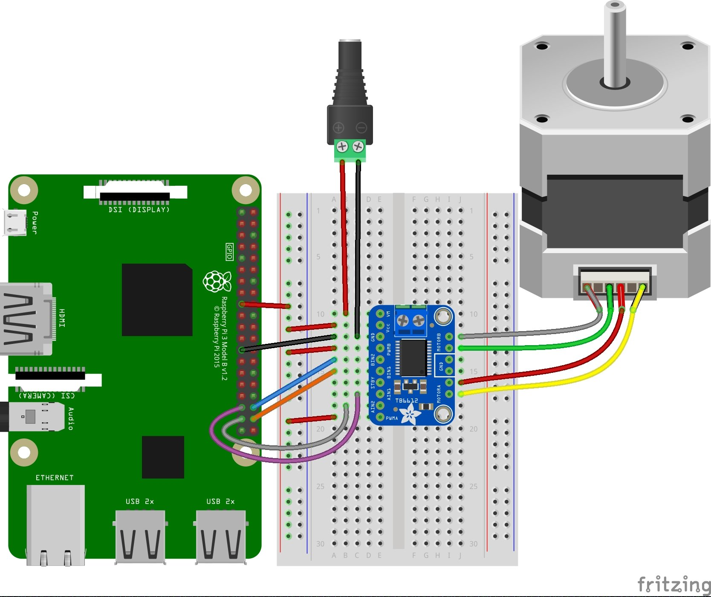

# EyeBolt

VL53L3CX Time-Of-Flight ToF Ranging Sensor Module Breakout 3Meter 940Nm...

VL6180X VL6180 Range Finder Optical Ranging Sensor Module for Arduino

https://thepihut.com/products/raspberry-pi-pico (3v logic)

Can it drive a nema stepper directly? Nope.

Can I use one of the 2 Adafruit motor shield v2.3 I have handy? Nope.


https://learn.adafruit.com/adafruit-feather-rp2040-pico/pinouts

Adafruit DRV8833


https://learn.adafruit.com/use-dc-stepper-servo-motor-solenoid-rp2040-pico?view=all


I've just gotten hold of one of these:

Adafruit TB6612 1.2A DC/Stepper motor Driver
http://adafru.it/2448 https://learn.adafruit.com/adafruit-tb6612-h-bridge-dc-stepper-motor-driver-breakout

Power Pins

Vmotor - This is the voltage for the motors, not for the logic level. Keep this voltage between 4.5V and 13.5V. This power supply will get noisy so if you have a system with analog readings or RF other noise-sensitive parts, you may need to keep the power supplies seperate (or filtered!)

Vcc - this is the voltage for the logic levels. Set to the voltage logic you'll be using on your microcontroller. E.g. for Arduinos, 5V is probably what you want. Can be 2.7V to 5.5V so good for 3V or 5V logic

GND - This is the shared logic and motor ground. All grounds are connected

Signal in Pins
These are all 'Vcc logic level' inputs
INA1, INA2 - these are the two inputs to the Motor A H-bridges
PWMA - this is the PWM input for the Motor A H-bridges, if you dont need PWM control, connect this to logic high.
INB1, INB2 - these are the two inputs to the Motor B H-bridges
PWMB - this is the PWM input for the Motor B H-bridges, if you dont need PWM control, connect this to logic high.
STBY - this is the standby pin for quickly disabling both motors, pulled up to Vcc thru a 10K resistor. Connect to ground to disable.

Motor Out Pins
These are 'Vmotor level' power outputs

Motor A - these are the two outputs for motor A, controlled by INA1, INA2 and PWMA
Motor B - these are the two outputs for motor B, controlled by INB1, INB2 and PWMB

https://learn.adafruit.com/adafruit-tb6612-h-bridge-dc-stepper-motor-driver-breakout/using-stepper-motors

We'll wire it to a Metro, but you can use any microcontroller you like!

Connect:

Vmotor to 12V (red wire)
Vcc to 5V (orange wire)
PWMA and PWMB to Vcc (orange wire)
GND to ground
AIN2 to Digital 4
AIN1 to Digital 5
BIN1 to Digital 6
BIN2 to Digital 7


Motor: Then hook one stepper motor coil to Motor A (red and yellow) and the second coil to Motor B (green and gray/brown). If you have another motor, you'll need to experiment a little to figure out which wires are which coil. Check any documentation you have! You can use a multimeter to measure between wires, the ones with a small resistance between them are a pair to a coil, for example. If the motor is vibrating but not spinning, check all wires are connected and try flipping around a pair or rechecking the wire pairs.

https://learn.adafruit.com/adafruit-tb6612-h-bridge-dc-stepper-motor-driver-breakout/python-circuitpython


I plan to power the motor with my soldering iron power lead (+many other used lead) which is 12V 2A tip positive.

The short black power socket lead I have is also wired red to `tip positive` to red lead, so that's easy to remember.

The motor looks to be the easy part.

Does it matter if its a 9v or 12V stepper I wonder?

# Putting circuit on the pico #

Booted pico with bootSelect held down.

Downloaded, and dropped adafruit-circuitpython-raspberry_pi_pico-en_US-6.3.0.uf2 onto device rp2

It reappears as circuitpy (E:)

I already have Mu installed (awful IDE, but handy)

I need the adafruit motor library.
Downloaded the library bundle from https://circuitpython.org/libraries

Copied adafruit_motor into E:\lib


```
The DRV8833 motor controller can control the two motor coils inside the stepper motor (think of it like a circular bucket brigade passing the power around A-B-A-B-A-B and so on) by receiving signals from four digital output pins on the Pico.

Wire it up as shown in the diagram here:
```




Board VM to positive terminal on barrel jack
Board GND to negative terminal on barrel jack

Barrel jack to 9V power supply

Breadboard power rail to Pi 3.3V
Board VCC to breadboard power rail
Board PWMB to breadboard power rail
Board PWMA to breadboard power rail

Board GND to Pi GND

coils = (
    digitalio.DigitalInOut(board.D9),  # A1
    digitalio.DigitalInOut(board.D10),  # A2
    digitalio.DigitalInOut(board.D11),  # B1
    digitalio.DigitalInOut(board.D12),  # B2
)

Board BIN2 to Pi D21
Board BIN1 to Pi D20
Board AIN1 to Pi D19
Board AIN2 to Pi D26

Board MOTORA (two pins) to stepper coil (red and yellow stepper wires)
Board MOTORB (two pins) to stepper coil (green and grey stepper wires)


# Not sure #


Pico

Pico pin 27 (GP21)  to driver pin BIN1
Pico pin 26 (GP20) to driver pin BIN2
Pico pin 25 (GP19) to driver pin AIN2
Pico pin 24 (GP18) to driver pin AIN1

Pico GND to driver GND
Pico 3v3 to driver VM

Nema 14 Bipolar 1.8deg 5Ncm (7.08oz.in) 0.4A 10V 35x35x20mm 4 Wires
  - Ship from: Germany	14HS08-0404S

  360 / 1.8 = 200 steps per revolution.