# EyeBolt #

## 13th July 2023 ##

Where are we up to?
I'm now capturing runs of cropped 950x950 images with low noise.
This took a lot of messing - but I'm very please with the result.

## 8th July 2023 ##

Because of the field of view, I don't care about much of the image.
Pico has limit - Max 150kb of data
Ideally I'd like 1.5mb for 900x900 at full resolution - but equally I don't care about most of the those pixels, only the red ones.

Most experiments with 2560x1440 at high compression (24)
Binning is automatically enabled when output size is less 1440, so wondered where many of my pixels went when I used small output.

The library I am using is really useful for setting the 100s of registers and capturing the output data.
But output size is set using an enum indexing into a table.

I didn't really want to abandoned the library, since its setting dozens of useful register values, but I want to use an output format that's not one of the pre-canned enum rows in the table.

The library itself is compiled into binary for efficiency, so I can't change it - but it turns out the table values are read-write so I can overwrite one row in the table.

I started off copying all the values from a working row, and setting the offsets to shuffle a cropped window along.

The camera works in two modes depending on the output size - so the values are used differently depending, which took me a while to figure out.

With a bit of trial and error, managed to shift the capture window the be 950x950 (without scaling?)

Capturing fewer pixels allowed me to lower the compression from 24 to 6 (very close to 5)

The next issue to address is the noise.
The library is very video-focused and doesn't expose any of the setting related to the auto-exposure or auto-gain controls.

Here I have to go to the data sheet and start messing with individual bits in registers.

My approach here was to set the camera to a known good state, take a photo, then adjust some experimental settings, and take a second photos and compare.


## 7th July 2023

Following other leads on long exposure:

https://forums.openmv.io/t/need-help-with-ov5640-exposure-timing/8238/5
https://forums.raspberrypi.com/viewtopic.php?t=350473


## 3rd July 2023 ##
Seem to have lost this link.
https://github.com/espressif/esp32-camera/issues/203

https://github.com/espressif/esp32-camera/blob/master/sensors/ov5640.c

## 2nd July 2023 ##

- If width is less than half of max width or height is less than half of max height then enable binning by setting _binning to be true
Further settings are the specified within _set_image_options()

- If width and height are equal to max width and max height then we don't need to scale, set _scale to false
- If width and height are equal to half max width and half max height then we don't need to scale if we using binning, set _scale to false
- Else we are using scaling:  `self._write_reg_bits(_ISP_CONTROL_01, 0x20, self._scale)` - this is using a mask to set the 5th bit

Other than the `_ISP_CONTROL_01 (0x5001) - # Bit[5]: Scale enable 0: Disable 1: Enable`
I don't see anything that sets scaling, and nothing uses the defined scaling registry addresses.

If you enable the value in this register, I think it must interpret the values X_OUTPUT_SIZE and Y_OUTPUT_SIZE differently.
X_OFFSET sn Y_OFFSET are used to define the copy before scaling and X_OUTPUT_SIZE and Y_OUTPUT_SIZE defined the scaled image size.

So, for the output size OV5640_SIZE_QHD (# 2560x1440)
h,      w,      mw,     mh,     sx, sy,     ex,     ey,     ox, oy, tx,     ty
2560,   1440,   2560,   1440,   0,  240,    2623,   1711,   32, 16, 2844,   1488, # QHD


```
self._binning = false # (1440 <= 1440 // 2) and (height <= max_height // 2)
self._scale = false # not ((true and true)

self._write_addr_reg(_X_ADDR_ST_H, 0, 240)
self._write_addr_reg(_X_ADDR_END_H, 2623, 1711)
self._write_addr_reg(_X_OUTPUT_SIZE_H, 2560, 1440)

self._write_addr_reg(_X_TOTAL_SIZE_H, 2844, 1488)
self._write_addr_reg(_X_OFFSET_H, 32, 16)

self._write_reg_bits(_ISP_CONTROL_01, 0x20, self._scale)
```

Thinking about moving away from jpeg again.
Example gif code:
``` 
frame = wait_record_pressed_update_display(True, cap)
    with open_next_image("gif") as f, gifio.GifWriter(
        f, cam.width, cam.height, displayio.Colorspace.RGB565_SWAPPED, dither=True
    ) as 
        ```

https://docs.circuitpython.org/en/latest/shared-bindings/gifio/index.html

file – Either a file open in bytes mode, or the name of a file to open in bytes mode.

width – The width of the image. All frames must have the same width.

height – The height of the image. All frames must have the same height.

colorspace – The colorspace of the image. All frames must have the same colorspace. The supported colorspaces are RGB565, BGR565, RGB565_SWAPPED, BGR565_SWAPPED, and L8 (greyscale)

The GIF frames are decoded into RGB565 big-endian format. displayio expects little-endian, so the example above uses Colorspace.RGB565_SWAPPED.

https://learn.adafruit.com/saving-bitmap-screenshots-in-circuitpython/overview
```
This guide introduces a CircuitPython library which is compatible with CircuitPython 5.0 and later. The library allows the programmer to take the pixels in a bitmap or on a screen and save them into standard 24 bits per pixel BMP files. Files may be on the CircuitPython USB flash filesystem (if it's set to writable mode) or onto a SD card.

To save bitmaps and screenshots you will need to add adafruit_bitmapsaver.mpy to the CIRCUITPY/lib directory.

save_pixels('/sd/pypaint.bmp', self._fg_bitmap, self._fg_palette)
```
http://paulbourke.net/dataformats/ppm/


## 1st July 2023 ##
In my v12 code to TweakCameraSettings I am using cam._write_register()

If I want to check current values I should try _read_register()

Looking at the internals we have a method on OV5640:
```
 def _set_size_and_colorspace(self) -> None:  # pylint: disable=too-many-locals
        
        # I am using  size=adafruit_ov5640.OV5640_SIZE_QHDA = 14  # 2560x1440
        size = self._size
        # [2560, 1440, _ASPECT_RATIO_16X9], # QHD
        # _ASPECT_RATIO_16X9 = const(4)
        width, height, ratio = _resolution_info[size]
        # _ratio_table = [
        #  mw,   mh,  sx,  sy,   ex,   ey, ox, oy,   tx,   ty
        #[2560, 1440, 0, 240, 2623, 1711, 32, 16, 2844, 1488],  # 16x9
        #]

        self._w = width     # 2560
        self._h = height    # 1440
        (
            max_width,      # 2560
            max_height,     # 1440
            start_x,        # 0
            start_y,        # 240
            end_x,          # 2623
            end_y,          # 1711
            offset_x,       # 32
            offset_y,       # 16
            total_x,        # 2844
            total_y,        # 1488
        ) = _ratio_table[ratio]

    

        self._binning = (width <= max_width // 2) and (height <= max_height // 2)
        self._scale = not (
            (width == max_width and height == max_height)
            or (width == max_width // 2 and height == max_height // 2)
        )

        self._write_addr_reg(_X_ADDR_ST_H, start_x, start_y)
        self._write_addr_reg(_X_ADDR_END_H, end_x, end_y)
        self._write_addr_reg(_X_OUTPUT_SIZE_H, width, height)

        if not self._binning:
            self._write_addr_reg(_X_TOTAL_SIZE_H, total_x, total_y)
            self._write_addr_reg(_X_OFFSET_H, offset_x, offset_y)
        else:
            if width > 920:
                self._write_addr_reg(_X_TOTAL_SIZE_H, total_x - 200, total_y // 2)
            else:
                self._write_addr_reg(_X_TOTAL_SIZE_H, 2060, total_y // 2)
            self._write_addr_reg(_X_OFFSET_H, offset_x // 2, offset_y // 2)

        self._write_addr_reg(_X_TOTAL_SIZE_H, total_x - 200, total_y // 2)
        self._write_addr_reg(_X_OFFSET_H, offset_x // 2, offset_y // 2)

        self._write_reg_bits(_ISP_CONTROL_01, 0x20, self._scale)
```
mw	2560				
mh	1440				
sx	0	_X_ADDR_ST_H			
sy	240	_X_ADDR_ST_H			
ex	2623	_X_ADDR_END_H			
ey	1711	_X_ADDR_END_H			
ox	32	_X_OFFSET_H	If not binning	16	_X_OFFSET_H
oy	16	_X_OFFSET_H	If not binning	8	_X_OFFSET_H
tx	2844	_X_TOTAL_SIZE_H	If not binning	2644	
ty	1488	_X_TOTAL_SIZE_H	If not binning	744	
scale	0	_ISP_CONTROL_01	0x20		


```
def _write_addr_reg(self, reg: int, x_value: int, y_value: int) -> None:
        self._write_register16(reg, x_value)
        self._write_register16(reg + 2, y_value)
```

There are two different window configurations, depending on if scaling is enabled.

The values above don't appear to make sense. What registers are they going into?

The OV5640 sensor has an image array of 2624 columns by 1964 rows
Of the 5,153,536 pixels, 5,038,848 (2592x1944) are active pixels and can be output. The other pixels are used for black 
level calibration and interpolation.


## 30th June 2023 ##
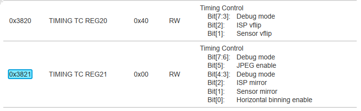

The 8 bits of register 0x3821 control multiple things:
- jpeg enabled
- isp mirror
- sensor mirror
- horizontal binning

When setting the windowing, I will need to or in my additional bits.

The OV5640 using registers 0x3800 -> 0x3814 for image windowing.
(but maybe not all the bits)

| Address    | Register Name     | Default Value | Description                             |
|------------|-------------------|---------------|-----------------------------------------|
| OX3800     | TIMING HS         | 0x00          | X address start high byte[ll:8] high byte |
| OX3801     | TIMING HS         | 0x00          | X address start low byte[7:0] low byte |
| OX3802     | TIMING VS         | 0x00          | Y address start high byte[10:8] high byte |
| OX3803     | TIMING VS         | 0x00          | Y address start low byte[7:0] low byte |
| OX3804     | TIMING HW         | 0x0A          | X address end high byte[11:8] high byte |
| OX3805     | TIMING HW         | 0x3F          | X address end low byte[7:O] low byte |
| OX3806     | TIMING VH         | 0x07          | Y address end high byte[10:8] high byte |
| OX3807     | TIMING VH         | 0x9F          | Y address end low byte[7:O] low byte |

DVP - Digital video port parallel output interface
```The Digital Video Port (DVR) provides 10-bit parallel data output in all formats supported and extended features including 
compression mode, HSYNC mode, CClR656 mode, and test pattern output. The DVP is also used to receive the video 
data from an external camera, which will be sent out through the OV5640 MIPI interface. ```

| OX3808     | TIMING DVPHO      | 0x0A          | DVP output horizontal width[ll:8] high byte|
| OX3809     | TIMING DVPHO      | OX20          | DVP output horizontal width[7:0] low byte |
| OX380A     | TIMING DVPVO      | OX07          | DVP output vertical height[10:8] high byte |
| OX380B     | TIMING DVPVO      | OX98          | DVP output vertical height[7:0] low byte |
| OX380C     | TIMING HTS        | 0x0B          | Total horizontal size[ll high byte |
| OX380D     | TIMING HTS        | 0x1C          | Total horizontal size[7:0] low byte |
| OX380E     | TIMING VTS        | 0x07          | Total vertical size[1 5:8] high byte |
| OX380F     | TIMING VTS        | 0xB0          | Total vertical size[7:0] low byte |
| OX3810     | TIMING HOFFSET    | 0x00          | ISP horizontal offset[ll :8] high byte |
| OX3811     | TIMING HOFFSET    | 0x10          | ISP horizontal offset[7:0] low byte |
| OX3812     | TIMING VOFFSET    | 0x00          | ISP vertical offset[10:8] high byte  |
| OX3813     | TIMING VOFFSET    | 0x04          | ISP vertical offset[7:0] low byte  |


From the manual:

+------------------+--------------+-----------+------------------------------------+----------------+
|      Format      | Resolution   | Frame Rate|         Scaling Method             |  Pixel Clock   |
+------------------+--------------+-----------+------------------------------------+----------------+
|    5 Mpixel      |  2592X1944   |   15 fps  |   Full resolution (dummy 16 pixels, |   96/192 MHz   |
|                  |              |           |   horizontal, 8 lines)             |                |
+------------------+--------------+-----------+------------------------------------+----------------+
|    1280X960      |  1280X960    |   45 fps  |   2608x1952 with dummy              |   96/192 MHz   |
|                  |              |           |   subsampling in vertical and       |                |
|                  |              |           |   horizontal                        |                |
+------------------+--------------+-----------+------------------------------------+----------------+
|    1080P         |  1920X1080   |   30 fps  |   1296X968                          |   96/192 MHz   |
+------------------+--------------+-----------+------------------------------------+----------------+
|    720P          |  1280X720    |   60 fps  |   Supports 2x2 binning              |   96/192 MHz   |
+------------------+--------------+-----------+------------------------------------+----------------+
|    VGA           |  640X480     |   90 fps  |   Cropping from full resolution     |   48/96 MHz    |
|                  |              |           |   (1936x1088 with dummy pixels)     |                |
+------------------+--------------+-----------+------------------------------------+----------------+
|    QVGA          |  320X240     |   120 fps |   Cropping 2592x1944 to 2560x1440   |   24/48 MHz    |
|                  |              |           |   Subsampling in vertical and       |                |
|                  |              |           |   horizontal                        |                |
+------------------+--------------+-----------+------------------------------------+----------------+


## 29th June 2023 ##
Using code 11 I tried lots of different camera settings. There were better and worse settings, but none of them I would say were good, and there were lots of errors.
The errors might be the result of me changing the settings to frequently.


## 15th June 2023 ##
Lets look at how I could capture higher quality in less memory.

https://docs.python.org/3/c-api/buffer.html#bufferobjects


## 4th June 2023 ##
Adding SD card to camera module to aid calibration.

I want high quality images - going to try writing from camera to SD card.

06_ will mix together 04_largeBitmapCapture with protoMicroSDWithMotor.

Additional libs:
adafruit_sdcard.mpy which I've taken from adafruit-circuitpython-bundle-7.x-mpy-20230325

Saving images at SXGA (1280x1024)
Quality - Controls the JPEG quality.  Valid range is from 2..55 inclusive

Quality 4
1280 1024
327680
Traceback (most recent call last):
  File "code.py", line 193, in <module>
  File "code.py", line 164, in main
MemoryError: memory allocation failed, allocating 327680 bytes


## 24th May 2023 ##
Camera calibration

Give me an overview of how to perform OpenCV's cv2.calibrateCamera function.
https://docs.opencv.org/4.x/dc/dbb/tutorial_py_calibration.html


Instead of chess board, we can alternatively use a circular grid. In this case, we must use the function cv.findCirclesGrid() to find the pattern. Fewer images are sufficient to perform camera calibration using a circular grid.

https://longervision.github.io/2017/03/18/ComputerVision/OpenCV/opencv-internal-calibration-circle-grid/

## 23rd May 2023 ##

Micro SD cards.

I can't keep sending image data across the serial terminal - it's madness. Maybe once I have the processing algorithm dialed in I can put it back on the pico, but to start with, I think I want to capture a load of full res- images.

I plan to add a micro SD card reader to the pico.
I had one in my box of bits, but it was a generic one, which didn't look like it could use `sdcardio`.

I bought an Adafruit MicroSD Card breakout+ (P254)
https://www.adafruit.com/product/254

This has the DI and DO pins, so I should be able to follow this guide: https://learn.adafruit.com/adafruit-micro-sd-breakout-board-card-tutorial/circuitpython

I don't so the pi pico on the list, so cannot verify that it supports sdcardio. If it does not, I will try using adafruit_sdcard instead.

Wiring: https://learn.adafruit.com/adafruit-micro-sd-breakout-board-card-tutorial/arduino-wiring

Because SD cards require a lot of data transfer, they will give the best performance when connected up to the hardware SPI pins.

SPI Example
To setup a SPI bus, you specify the SCK, MOSI (microcontroller out, sensor in), and MISO (microcontroller in, sensor out) pins. 
The Pico uses a different naming convention for these:

SPIx_SCK = SCK
SPIx_TX = MOSI
SPIx_RX = MISO
So use that mapping to help find available pins.

import board
import busio
spi = busio.SPI(clock=board.GP2, MOSI=board.GP3, MISO=board.GP4)

This clashes with the pins I've used for the motor so far, so I will need to re-prototype that.

Connect the 5V pin to the 5V pin on the Arduino
Connect the GND pin to the GND pin on the Arduino

Connect (Brown) CLK to pin 13 SCK (SPIx_SCK) clock=board.GP2
Connect (Orange) DO to pin 12 MISO (SPIx_TX) MISO=board.GP4
Connect (Yellow) DI to pin 11 MOSI (SPIx_RX ) MOSI=board.GP3
Connect (Green) CS to pin 10 (you will also need a fourth pin for the 'chip/secondary select' (SS))

`Go to the beginning of the sketch and make sure that the chipSelect line is correct, for this wiring we're using digital pin 10 so change it to 10!`
`Use 8.3 format for file names`

Soldered up the wires and connecting to a pico on a protoboard.
Copied across library adafruit_sdcard.mpy which I've taken from adafruit-circuitpython-bundle-7.x-mpy-20230325

Edited the file list example into \Mk5\Code\protoMicroSD - run it and listed the files on the SD card.

Next test is to write a file - and generate unique filename in 8.3

I have to move the motor now too, as that was overlapping with the SPI pins.
I don't think it needed to.


```
import board
import busio
import sdcardio
import storage
# Use the board's primary SPI bus
spi = board.SPI()
# Or, use an SPI bus on specific pins:
#spi = busio.SPI(board.SD_SCK, MOSI=board.SD_MOSI, MISO=board.SD_MISO)

# For breakout boards, you can choose any GPIO pin that's convenient:
cs = board.D10
```

Another quick experiment in \Mk5\Code\protoMicroSDWithMotor

Moved motor pins to 6,7,8 & 9. This works, but that now clashes with 7,8 & 9 being used by the camera!

I've managed to move to the motor to 22,26,27 & 28.

That leaves my GP6 free for E-brake, and maybe 0 and 1 - but I never like using them.

## 30th April 2023 ##

First light?

OV5640_COLOR_RGB = 0
OV5640_COLOR_YUV = 1
OV5640_COLOR_GRAYSCALE = 2
OV5640_COLOR_JPEG = 3
https://github.com/adafruit/Adafruit_CircuitPython_OV5640/blob/main/adafruit_ov5640.py

OV5640_SIZE_96X96 = 0  # 96x96
OV5640_SIZE_QQVGA = 1  # 160x120
OV5640_SIZE_QCIF = 2  # 176x144
OV5640_SIZE_HQVGA = 3  # 240x176
OV5640_SIZE_240X240 = 4  # 240x240
OV5640_SIZE_QVGA = 5  # 320x240
OV5640_SIZE_CIF = 6  # 400x296
OV5640_SIZE_HVGA = 7  # 480x320
OV5640_SIZE_VGA = 8  # 640x480
OV5640_SIZE_SVGA = 9  # 800x600
OV5640_SIZE_XGA = 10  # 1024x768
OV5640_SIZE_HD = 11  # 1280x720
OV5640_SIZE_SXGA = 12  # 1280x1024
OV5640_SIZE_UXGA = 13  # 1600x1200
OV5640_SIZE_QHDA = 14  # 2560x1440
OV5640_SIZE_WQXGA = 15  # 2560x1600
OV5640_SIZE_PFHD = 16  # 1088x1920
OV5640_SIZE_QSXGA = 17  # 2560x1920

https://github.com/adafruit/Adafruit_CircuitPython_BitmapSaver
https://learn.adafruit.com/circuitpython-display-support-using-displayio/bitmap-and-palette

https://cdn-learn.adafruit.com/assets/assets/000/118/553/thumb100square/adafruit_products_img0006.jpg?1676489257

## 19th April 2023 - Mark V progress ##

I've been working on this perhaps more than I realise.
So, a quick video to capture the changes.

I set out to test the camera - which means wiring up the camera board.
But before did that, I decided I wanted to test the other features of the board, which in this design means control of the turn table.

I start out with the parts I stripped out of the mark 4.
I used the Tb6612 motor control board, with the beefy 12volt nema 17 motor.

I made a timing belt driven system where a 20 tooth gear on the motor drives a 400 tooth belt around the outside of this 3d printed turntable.
This gives me 1800 steps per revolution - but it was noisy and a bit rough.

In the previous design I had one motor turning a pair of chunk lead screws - pushing assemblies along a pair of linear rails. It needed some grunt.

But here, I'm just spinning a table in free space - no grunt needed. So i've switch down a litte 5v 28BYJ geared stepper. This gives me 512 steps be revolution and is buttery smooth and silent.

In other news, I've started to mount the components in their box.

I'm just 3d printing frame sections, that clip over the rim of the box, and align the content to be vertical.

Here I have the camera board and pico mounted on a protoboard (which is not yet wired) And I have the Powell lense laser tacked on the end.

I'm thinking I should make the turn table attach to this, to make a single unit, rather than fixing it to the box. This would make allow me to make a CAD model of the whole assembly, rather than try to measure it accurately.

Not sure about that yet.

Next steps? Well, Now I've proven I can drive the turn table, I should start wiring up nthe camera and try to get a first image.


Nema 17 = 200 steps per revolution
20 tooth cog, so 10 steps per tooth.
Driving a 180 tooth table, to 1800


## 14th April 2023 - Stepper trouble ##
I'm reducing the number of stepper motors from 2 to 1.
I only need a motor to driver the turntable.

I've made a motor and table assembly with a 400 tooth 2gt timing belt. Small gear has 20 teeth and large gear has 180.

I'm struggling to get any motor to run smoothly and reliably. I've switch out motor driver boards and nema 17 motors. It's all very rattly.

Since there is almost no load on this motor, I'm considering switching down to a tiny 28byj-48, 5V stepper.

https://microcontrollerslab.com/28byj-48-stepper-motor-raspberry-pi-pico-micropython/

https://forums.adafruit.com/viewtopic.php?f=19&t=117680

I also found a suggestion for diagnosing the control lines, so I might try that first too.


## 10th April 2023 - Wiring up camera protoboard ##
I have a protoboard for the pico from Monk makes

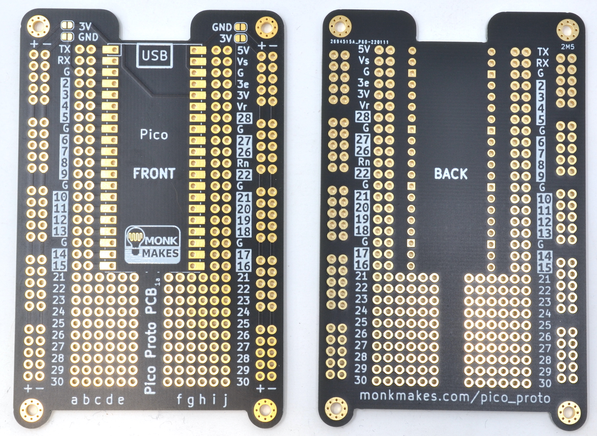

Which seems perfect for this wiring job. I have the camera on via a socket and the pico soldered directly on board.

I have a 5v 3v3 and Gnd rail, and the camera pins are broken out onto columns, which should make is easy for me to solder them.

My next question, is do I have 5 spare pins for the motor board?


Whilst I print test-support pieces to interface the camera board and the prototboard, I'm thinking about the new turn table:

https://avtehnik.github.io/gt2-gear-genaretor/

Using a 140 tooth turntable, using a belt length tool:

https://www.technobotsonline.com/timing-pulley-distance-between-centres-calculator.html

140 on larger PCD (dp) 89.127
20 on smaller PCD (dp) 12.732
Distance between centers 113.577
Belt length 400mm


## 8th April 2023 - Start of the Mark V ##

Adafruit OV5640 Camera Breakout - 120 Degree Lens
https://learn.adafruit.com/adafruit-ov5640-camera-breakout/raspberry-pi-pico-usage

Camera connections
For the Raspberry Pi Pico setup shown in these examples, wire the following connections:

OV5640 GND to Pi Pico GND
OV5640 3V to Pi Pico 3V3
OV5640 SDA to Pi Pico GP8
OV5640 SCL to Pi Pico GP9
OV5640 HS to Pi Pico GP21
OV5640 VS to Pi Pico GP7
OV5640 XC to Pi Pico GP20
OV5640 PC to Pi Pico GP11
OV5640 D2..D9 to Pi Pico GP12..GP19
OV5640 RT to Pi Pico GP10

The pull-up resistors shown on GP8 and GP9 are not required for Adafruit's OV5640 camera break-out board but may be required for other camera breakout boards.

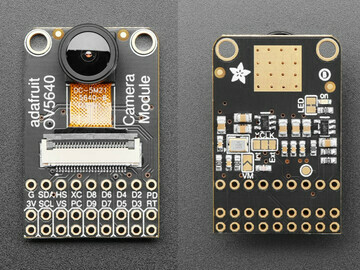


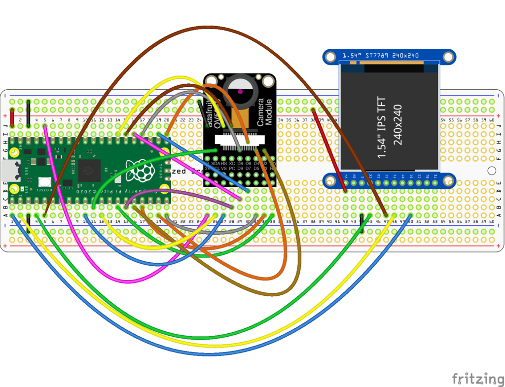


The camera module requires a well-regulated 3.3v supply in order to operate.

**G (GND):** Connect to microcontroller GND

**3V (3.3V):** Connect to microcontroller +3.3V supply

PD (powerdown): Optional connection to microcontroller GPIO. When pulled HIGH the camera module is put into power-down mode. When released or pulled LOW the camera is powered on. This pin can also be pulsed HIGH as a way to reset the camera.
RT (reset): Optional connect to microcontroller GPIO. Pull the pin LOW to reset the camera module and release it or pull it HIGH to enter operating mode.
Both pins have built-in pull resistors, so by default the camera is powered on and allowed to exit reset mode.

The camera module must be configured using I2C.

**SDA:** Connect to microcontroller SDA

**SCL:** Connect to microcontroller SDL

**XC (external clock)**: When the XCLK jumper is set to "EXT" (the default), this pin must be driven with a 24MHz square wave from the microcontroller or other source. When the jumper is changed to "INT", then an on-board clock generator is used instead. In this case, the XC pin should not be driven by the microcontroller and may be left unconnected.

**PC (pixel clock)** tells the microcontroller when image data is available. This may need to be connected to a specific microcontroller pin.

**VS and HS** are synchronization signals, which tell the microcontroller when a new frame (VS) or row (HS) of data begins. These may need to be connected to specific microcontroller pins.

The 8 data pins (numbered from **D2 to D9** because reasons) carry data out of the camera into the microcontroller.

Depending on mode, these 8 data bits can be half of a 16-bit pixel value, or one byte of JPEG data.

```If your microcontroller has a 2x9 header available, that method is strongly preferred! The high speed signals of the camera module can be scrambled even with short lengths of jumper wire on a solderless breadboard.```

xclk, pclk, vsync, href: Free choice of any pin
reset, shutdown: Free choice of any pin. Can omit one or both, but the initialization sequence is less reliable.
data_pins: Any 8 sequential pins in GPIO ordering (e.g., GPIO2..GPIO9).

https://learn.adafruit.com/adafruit-ov5640-camera-breakout/ascii-mirror-dem


## 1st April 2023 - The End of the Mark IV ##

This project has been on pause for a while, whilst I've done other things - but it's very literally always there - taking up space in my study.

This is the Mark 4 - it's a laser beam scanner. There are a pair of synchronized lead-screws, which move the laser and the sensor horizontally along these sturdy linear tracks.

The subject is placed on a linear rotary turntable. Combing the movement of the laser sensor with the 2 degrees of freedom of the table, you can gather 3D data from the occlusion of the data.

Both the table and the lead screws are driven by Nema steppers, the lead screws are synchronized via timing belts, and the turntable is driven via a 3d printed gear pair. Stepper driver boards are controlled by a pico, which coordinates the movement with the sensing.

I've got this built out as far as calibration - and partly looking at those results I've decided not to take this build any further.

The problems are:

1) Too many movement parts.
There's too much slop in the system. Just calibrating this with m2 machine screws, I'm seeing 1mm of inaccuracy on the position, which isn't going to give me the results I want.

2) Too big.
I was a little ambitious with my scan volume
I was limited height-wise by by my turntable design
I was limited length-wise by not wanting to cut up the lead screws and linear rails.
So I build this into this big crate - which isn't something I want to have hanging around (like it has for the past year).

## 11th September 2022 ##

Something I was reader referred to circuitPython AsyncIO - which I don't think was a thing back when I started this project 2 years ago.

This isn't preemptive multi-tasking, but cooperative. You can't break into the event loop following an interrupt, but one task can cede control (let other tasks run) when it is waiting (e.g time.sleep)

This might be a good way forward for me, to try and keep the motor movement fluid. At the moment there are sleep statements in every motor step.

Potentially I could be checking the abort button and the laser sensor whilst the motors are paused.

I'm going to have a play with tis code in Mk4\Code\AsyncIO\Prototype01\code.py

Guide here: <https://learn.adafruit.com/cooperative-multitasking-in-circuitpython-with-asyncio>

```
# SPDX-FileCopyrightText: 2022 Dan Halbert for Adafruit Industries
#
# SPDX-License-Identifier: MIT

import asyncio
import board
import digitalio


async def blink(pin, interval, count):
    with digitalio.DigitalInOut(pin) as led:
        led.switch_to_output(value=False)
        for _ in range(count):
            led.value = True
            await asyncio.sleep(interval)  # Don't forget the "await"!
            led.value = False
            await asyncio.sleep(interval)  # Don't forget the "await"!
        # These tasks finish whenever the for-loop expires

async def main():
    led1_task = asyncio.create_task(blink(board.D1, 0.25, 10))
    led2_task = asyncio.create_task(blink(board.D2, 0.1, 20))

    await asyncio.gather(led1_task, led2_task)  # Don't forget "await"!
    print("done")


asyncio.run(main())
```

What about sharing memory between tasks?

```
# SPDX-FileCopyrightText: 2022 Dan Halbert for Adafruit Industries
#
# SPDX-License-Identifier: MIT

import asyncio
import board
import digitalio
import keypad


class Interval:
    """Simple class to hold an interval value. Use .value to to read or write."""

    def __init__(self, initial_interval):
        self.value = initial_interval


async def monitor_interval_buttons(pin_slower, pin_faster, interval):
    """Monitor two buttons: one lengthens the interval, the other shortens it.
    Change interval.value as appropriate.
    """
    # Assume buttons are active low.
    with keypad.Keys(
        (pin_slower, pin_faster), value_when_pressed=False, pull=True
    ) as keys:
        while True:
            key_event = keys.events.get()
            if key_event and key_event.pressed:
                if key_event.key_number == 0:
                    # Lengthen the interval.
                    interval.value += 0.1
                else:
                    # Shorten the interval.
                    interval.value = max(0.1, interval.value - 0.1)
                print("interval is now", interval.value)
            # Let another task run.
            await asyncio.sleep(0)


async def blink(pin, interval):
    """Blink the given pin forever.
    The blinking rate is controlled by the supplied Interval object.
    """
    with digitalio.DigitalInOut(pin) as led:
        led.switch_to_output()
        while True:
            led.value = not led.value
            await asyncio.sleep(interval.value)


async def main():
    interval1 = Interval(0.5)
    interval2 = Interval(1.0)

    led1_task = asyncio.create_task(blink(board.D1, interval1))
    led2_task = asyncio.create_task(blink(board.D2, interval2))
    interval1_task = asyncio.create_task(
        monitor_interval_buttons(board.D3, board.D4, interval1)
    )
    interval2_task = asyncio.create_task(
        monitor_interval_buttons(board.D5, board.D6, interval2)
    )

    await asyncio.gather(led1_task, led2_task, interval1_task, interval2_task)


asyncio.run(main())
```

This is perhaps a better way to go? Using countio as a layer over interupts?

```
import asyncio
import board
import countio

async def catch_interrupt(pin):
    """Print a message when pin goes low."""
    with countio.Counter(pin) as interrupt:
        while True:
            if interrupt.count > 0:
                interrupt.count = 0
                print("interrupted!")
            # Let another task run.
            await asyncio.sleep(0)


async def main():
    interrupt_task = asyncio.create_task(catch_interrupt(board.D3))
    await asyncio.gather(interrupt_task)

asyncio.run(main())
```

Inside the interrupt, I'd want to know the current value of X, and have someone to stash it.
We could clear and reset the values for each sweep.

Here main() is run with asyncio - I think I would need other tasks
Task per sweep?


## 6th September 2022 ##

A long line - but not too long.

Powell lenses are laser line generator lens that can fan out collimated beams in one dimension. They have the shape of a prism with a rounded roof, and are often used to transform a narrow laser beam into a uniformly illuminating line. 


If it has a 60 degree beam angle from a 7mm aperture, then at 30cm the beam length is huge.
If I reduce the aperture to 2.6mm then I should get around a 10cm line length at 30cm throw.


## 26th August 2022 ##
Calibrating using the long edge of the L-shaped print.

Zeroing X out at 0
Zeroing X (from 0)
Loop 0 of 10
Detect changed at 1800
Detect changed at 5650
Detect changed at 5630
Detect changed at 1780
Loop 1 of 10
Detect changed at 1800
Detect changed at 5650
Detect changed at 5630
Detect changed at 1780
Loop 2 of 10
Detect changed at 1800
Detect changed at 5650
Detect changed at 5630
Detect changed at 1780
Loop 3 of 10
Detect changed at 1800
Detect changed at 5650
Detect changed at 5630
Detect changed at 1770
Loop 4 of 10
Detect changed at 1800
Detect changed at 5660
Detect changed at 5640
Detect changed at 1780
Loop 5 of 10
Detect changed at 1810
Detect changed at 5660
Detect changed at 5690
Detect changed at 5710
Detect changed at 5640
Detect changed at 1780
Loop 6 of 10
Detect changed at 1800
Detect changed at 5650
Detect changed at 5640
Detect changed at 1780
Loop 7 of 10
Detect changed at 1810
Detect changed at 5650
Detect changed at 5630
Detect changed at 1780
Loop 8 of 10
Detect changed at 1800
Detect changed at 5660
Detect changed at 5700
Detect changed at 5710
Detect changed at 5630
Detect changed at 1780
Loop 9 of 10
Detect changed at 1800
Detect changed at 5650
Detect changed at 5630
Detect changed at 1780
Done!

Detect changed at 1800	1800	1800	1800	1800	1800	1810	1800	1810	1800	1800	1802	
Detect changed at 5650	5650	5650	5650	5650	5660	5660	5650	5650	5660	5650	5653	3851
Detect changed at 5630	5630	5630	5630	5630	5640	5640	5640	5630	5630	5630	5633	
Detect changed at 1780	1780	1780	1780	1770	1780	1780	1780	1780	1780	1780	1779	3854

Between 38.51 and 38.4mm
Measures 39.8


## 21st August 2022 ##

Have been away for two weeks. Just before I left I was working on calibrating the leadscrew movement.

After discovering I could focus the laser - I now need to determine if it's better to focus on the object or the sensor.

Using \Code\Operating\BeamMovementCalibrate\code3.py

```
I estimate 30mm to be an average of 2770 steps

I think the lead-screw is 2mm for 20 teeth
I think the belt drive is 1:1
The motor is 200 steps per revolution
30mm should be 3000 steps
01mm should be 100 steps
I this suggests the fuzz (region of uncertainty) at each end of my block is 1.15mm

Lengths in mm:
27.7
27.7
27.7
27.7
27.7
27.7
27.6
27.6
27.6
27.5
27.6
27.6
27.7
27.7
27.7
27.7
27.7
27.7
27.8
27.8
Measured length 29.84mm

Error (end to end): 
+/- 2.34
+/- 2.04

Happy with this, and the consistent movement in steps of 10 - how can it be improved?

Is there an offset or a reduction I'm not aware off?
It is the beam width? Can I just compensate for that? Does it always measure small?
```

Running again for 15mm block, whilst I print a 25x40mm block

1351 steps (13.5mm)

01mm should be 100 steps
15mm should be 1500 steps
less because there is an area of uncertainty

On the way back, the numbers as consistently lower, suggesting I could run a pass in both directions and take an average!
How to group the readings when they are s


## 29th July 2022 ##

I've just made a measurement of the number of stepper motor steps needed to complete one table revolution.

I put a pin in the table, so that it broke the beam twice per revolution.
I measure the number of steps in each of the 4 states, and averaged to calculate steps per revolution.

I did two runs with the beam at different positions, to get different length quarters

|blockedA|openA|blockedB|openB|sum        |
|--------|-----|--------|-----|-----------|
|28      |319  |39      |2071 |2457       |
|28      |404  |11      |2051 |2494       |
|27      |404  |13      |2044 |2488       |
|25      |416  |15      |2037 |2493       |
|24      |434  |18      |2030 |2506       |
|22      |422  |21      |2029 |2494       |
|20      |428  |22      |2027 |2497       |
|19      |429  |19      |2029 |2496       |
|20      |428  |18      |2029 |2495       |
|20      |430  |15      |2031 |2496       |
|19      |432  |19      |2024 |2494       |
|19      |437  |19      |2021 |2496       |
|17      |439  |21      |2018 |2495       |
|20      |447  |20      |2014 |2501       |
|12      |450  |22      |2009 |2493       |
|17      |449  |20      |2008 |2494       |
|18      |449  |20      |2003 |2490       |
|19      |455  |20      |2001 |2495       |
|20      |456  |22      |2002 |2500       |
|15      |465  |19      |1997 |2496       |
|18      |463  |17      |1999 |2497       |
|15      |467  |18      |1997 |2497       |
|        |     |        |     |2495.571429|

|blockedA|openA|blockedB|openB|sum        |
|--------|-----|--------|-----|-----------|
|11      |1139 |19      |1330 |2499       |
|19      |1139 |12      |1330 |2500       |
|13      |1139 |12      |1330 |2494       |
|19      |1139 |12      |1316 |2486       |
|19      |1141 |14      |1330 |2504       |
|16      |1140 |13      |1328 |2497       |
|15      |1140 |14      |1327 |2496       |
|15      |1142 |13      |1329 |2499       |
|14      |1138 |13      |1327 |2492       |
|15      |1146 |9       |1329 |2499       |
|15      |1142 |13      |1325 |2495       |
|18      |1140 |12      |1327 |2497       |
|15      |1143 |13      |1324 |2495       |
|17      |1142 |14      |1325 |2498       |
|15      |1142 |15      |1323 |2495       |
|15      |1144 |13      |1327 |2499       |
|14      |1143 |13      |1324 |2494       |
|12      |1145 |15      |1323 |2495       |
|14      |1148 |15      |1322 |2499       |
|10      |1145 |18      |1324 |2497       |
|        |     |        |     |2496.368421|


The gear ratio was designed to be 0.0800 

The motor has a step angle of 1.8deg
360 / 1.8 = 200 steps per revolution.

1.0 / 0.08 = 12.5

200 * 12.5 = 2500.

So the predicted number of steps for a revolution is 2500
The measured is ~2495
If I do 100 sample angles (sounds like a lot) that gives 25 steps per chunk, which feels enough to be accurate without backlash.

## 8th July 2022 ##

I have made a number of modifications to the drive - but I had troubles with the new motor.

The drive speed needed changing, and the wiring colours have changes. I used a breakboard to switch around the wires, having used the trick of spinning the motor by hand and shorting the pairs, to find when the resistance increases.

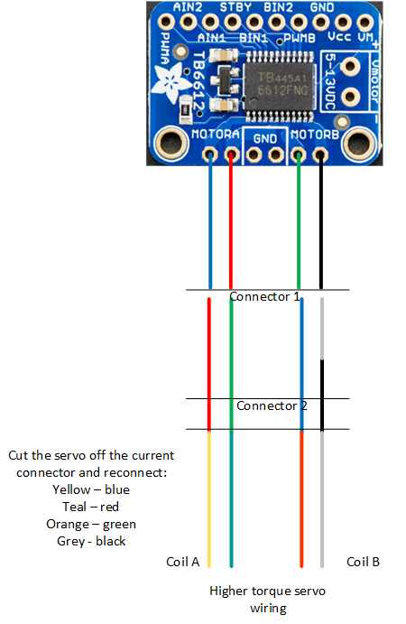

I have changed from a single belt (with tensioning) to two belts on a double drive gear.

## 11th Jun 2022 ##

### Gearbox ###
Working out a small gear box for the new table design


http://hessmer.org/gears/InvoluteSpurGearBuilder.html?circularPitch=3.2&pressureAngle=20&clearance=0.05&backlash=0.05&profileShift=0&gear1ToothCount=0&gear1CenterHoleDiamater=4&gear2ToothCount=8&gear2CenterHoleDiamater=4&showOption=3


https://evolventdesign.com/pages/gear-ratio-calculator

Number of Teeth: Input Gear: 20 (16mm diameter)
Number of Teeth: Gear 2:    80 (54mm diameter)
Number of Teeth: Gear 3:    24 (30mm diameter)
Number of Teeth: Gear 4:    75 (80mm diameter)

Gear Ratio:	0.0800

Input Speed:	200
Output Speed:	16.0000

Gears 1 & 2
http://hessmer.org/gears/InvoluteSpurGearBuilder.html?circularPitch=2&pressureAngle=20&clearance=0.05&backlash=0.05&profileShift=0&gear1ToothCount=20&gear1CenterHoleDiamater=5&gear2ToothCount=80&gear2CenterHoleDiamater=4&showOption=3

Gears 3 & 4
http://hessmer.org/gears/InvoluteSpurGearBuilder.html?circularPitch=3.5&pressureAngle=20&clearance=0.05&backlash=0.05&profileShift=0&gear1ToothCount=24&gear1CenterHoleDiamater=4&gear2ToothCount=75&gear2CenterHoleDiamater=8&showOption=3

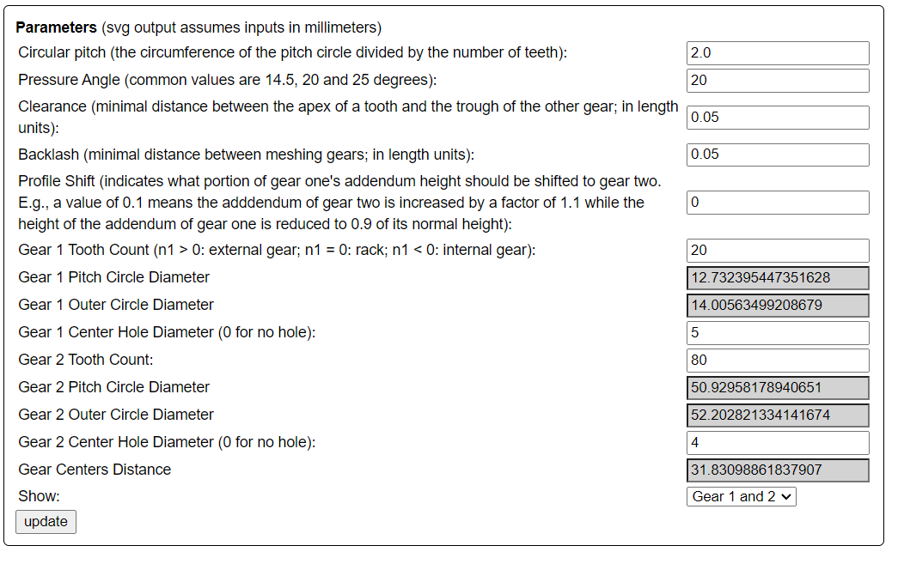
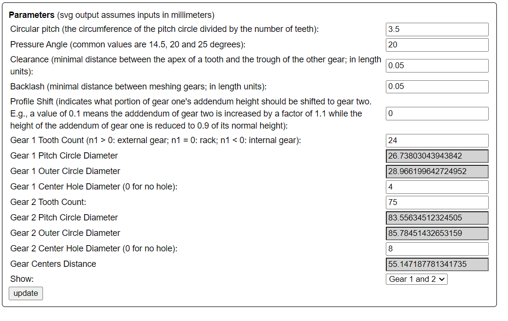

## Thumbstick ##

I felt like I needed more inputs/controls as I develop the Mk4.

Now that I have more travel, I want to be able to set limits for the scan region (to save time not scanning empty space)

The obvious input formats are up-confirm down-confirm to set the limits of the table (for the height of the part) and left-confirm right confirm to set the limits for the max extent of the part when rotated.

To avoid this input being an awkward series of switch presses, I decided to try and integrate a thumbstick.

The thumbstick from the sensor kit says 5v on the silk screen, but seems to work just fine on 3v3.
It has two analogue outs, which I feed into 26 and 27 (ADC ins on the pico) and a switch which I connect to 22 because it is nearby.

I'm not using the analogue values, only a less than 25% or more than 75% to detect left or right - else it gives no input.

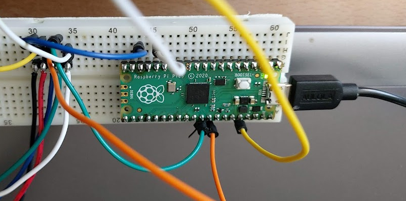
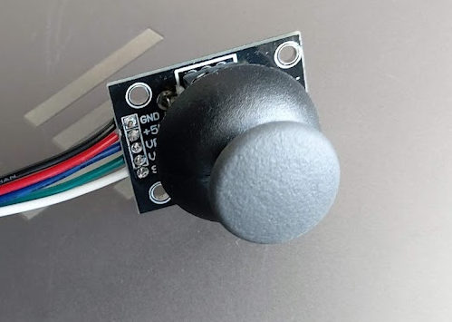

I wired it up on a breadboard with a test sketch - then soldered connectors onto the main pico shield.
22, 26 & 27 were thankfully unused. I also spliced on the power lines to the existing 3v3 and ground rows.

I had a bit of trouble wiring 22,26 & 27 and in the end I didn't get the colouring consistent on the thumbstick end and pico end (green and white are swapped).


### Nema no more ###


I thought my old motor might have been:
```Nema 14 Bipolar 1.8deg 5Ncm (7.08oz.in) 0.4A 10V 35x35x20mm 4 Wires```

But it turns out it is probably a:
```Stepper motor - NEMA-17 size - 200 steps/rev, 12V 350mA 20 N*cm,```

My driver (Adafruit TB6612) can handle 1.2A

So I've ordered:

```Nema 17 Bipolar Stepper 1.8deg 12v 1.2A 400mN.m 42x42x40mm 4-wires Nema17 CNC```

This hybrid bipolar Nema 17 stepper motor with 1.8 degree step angle (200 Steps / Revolution).
Manufacturer Part Number: 17HS3001-20B
Motor Type: Bipolar Stepper
Step Angle: 1.8 degree
Holding Torque: 400 mN.m
42.3mm*42.3mm*L40mm

New motor will only be x2 as strong (not x8) but still better. Plus it's a drop in replacement.
I might chose a smaller drive gear. This will mean less tooth contact, but less speed and torque multiplier.


## Mark 3 ##

Starting planning the next major redesign of the scanner - planning on going back to optical - but combination optical/mechanical using occlusion not Time Of Flight.

## KY-008 ##

https://arduinomodules.info/ky-008-laser-transmitter-module/

This module consists of a 650nm red laser diode head, a resistor and 3 male header pins. Handle with caution, do not point the laser beam directly to the eyes.

Operating Voltage	5V

Connect the module signal pin (S) to pin 13 on the Arduino and ground (-) to GND.

The middle pin on the module is not used.


## Receiver ##
Laser Receiver Sensor Module non-modulator Tube Pi Arduino Pic Lazer

The laser receiver sensor module uses a non-modulated laser receiver to detect the laser signal.

For use indoors where there is no light, sunlight or other sources of light which will interfere with the sensor, recommended for use in dark environments.

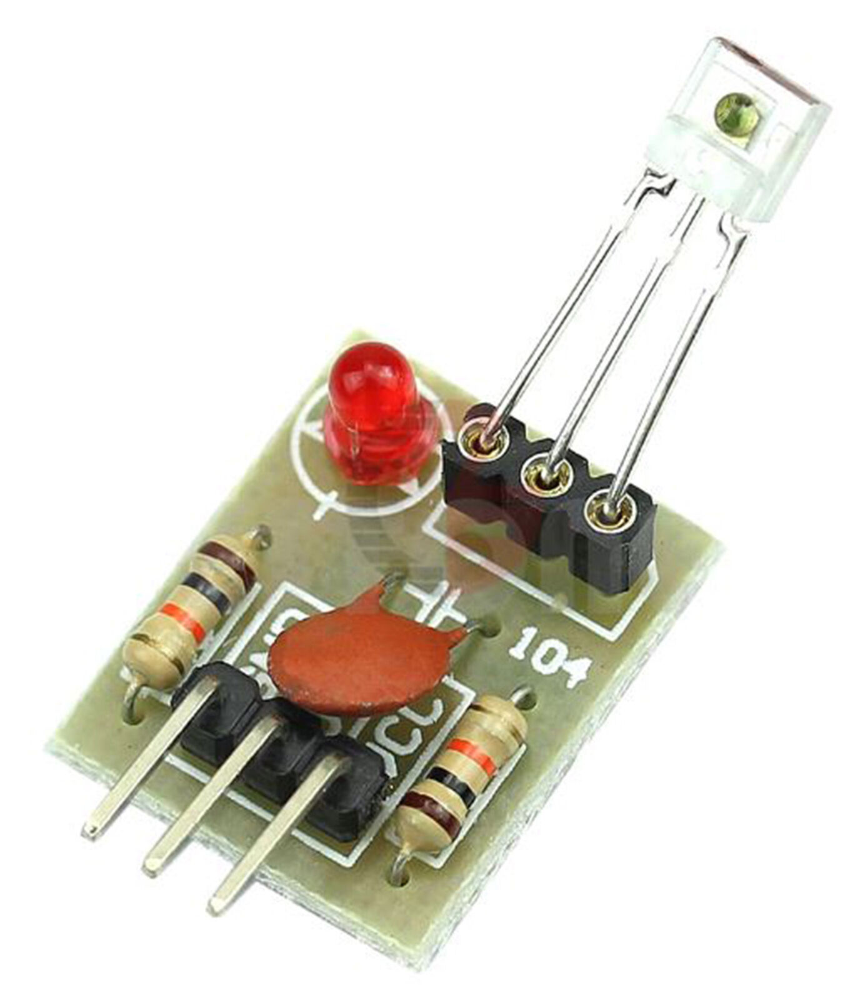
 
Voltage : 5v
Output high level when receive laser signal
Output low level when not receive laser signal
Size : 1.5cm x 1.9cm

https://www.codrey.com/electronic-circuits/the-mysterious-laser-receiver-sensor-module/


```
A cryptic 3-pin sensor?
The 3-pin sensor is actually a minuscule light sensor (receiver) diode with an integrated amplifier and an open-collector transistor at its output. Output of the module, designed to operate on 5VDC power supply, can only go low (L), and the open-collector transistor inside the 3-pin sensor can sink about 20mA current. The description “non-modulator tube” actually points the fact that the light sensor can handle any source of light and it’s not like a 3-pin  infrared sensor module (TSOP1838 for example) that only detects an infrared pulse train within a particular frequency band.

...the sensor is known in China as “ISO203 Laser Receiver”. You can see its pin notation in the image provided below.
```

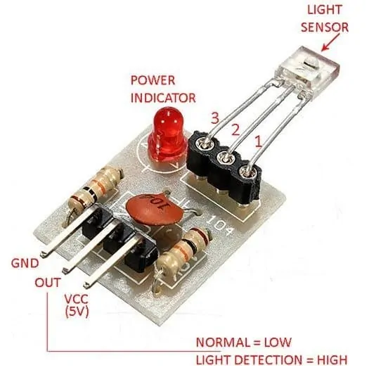


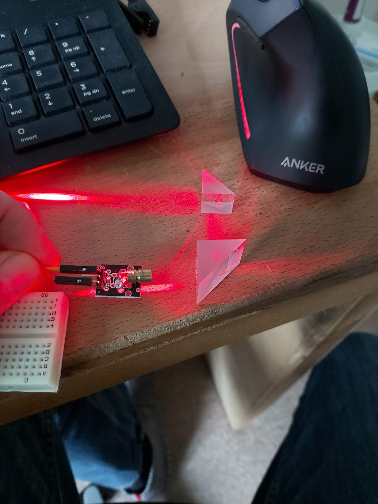
This is going to be so cool!


https://matplotlib.org/stable/gallery/mplot3d/voxels_rgb.html


After dealing with an issue where the ends of the arms bounce after the beginning and end of the stroke, I could start some calibration scans.


## 9th March 2022 ##

Hit various problems with boundary tracing.
Firstly, had to reduce tracing to 4-connected from 8-connected
Then remove small regions,

Now, with my new spring can scan, I have a boundary on level rev_i == 3 where the path crosses itself:

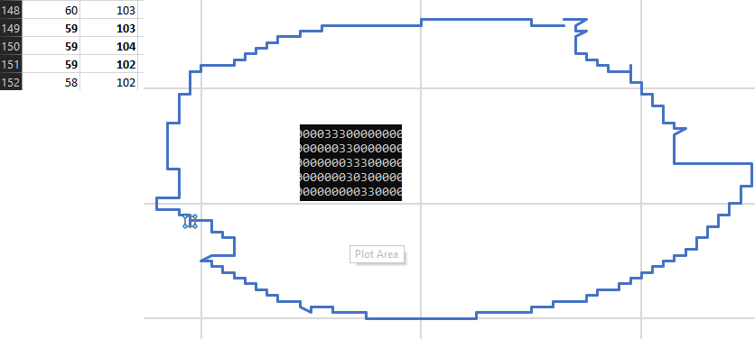

| Chunk  | N     | Steps       | diff |
|----|------|--------|---|
| 71 | 12   | 852   |   |
| 36  | 13   | 458     |   |
| 1  | 13.3 | 13.3   |   |
|108 |      | 1333.3 | 0 |

108
54
27

### Hat Scans ###


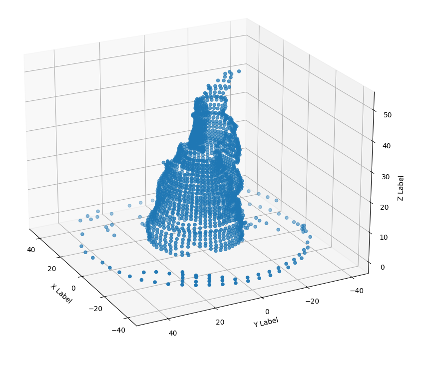


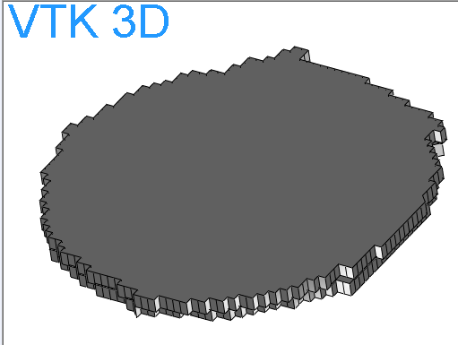

## 30th Sept 2021 ##

Push buttons have too much spring.
Can I get a photo interupter to work?
KY-10 <https://arduinomodules.info/ky-010-photo-interrupter-module/>

Connect the power line (middle) and ground (left) to +5V and GND respectively. Connect signal (S) to pin 3 on the Arduino.

Operating Voltage 3.3 ~ 5V

- (left) GND
middle +5V
S (right) Pin 3

```
int Led = 13; // define LED pin
int buttonpin = 3; // define photo interrupter signal pin
int val; //define a numeric variable

void setup()
{
 pinMode(Led, OUTPUT); // LED pin as output
 pinMode(buttonpin, INPUT); //photo interrupter pin as input
}

void loop()
{
 val=digitalRead(buttonpin); //read the value of the sensor 
 if(val == HIGH) // turn on LED when sensor is blocked 
 {
  digitalWrite(Led,HIGH);
 }
 else
 {
  digitalWrite(Led,LOW);
 }
}
```

### Gear Ratio ###

80 : 12
360 / 1.8 = 200 steps per revolution.

200 / 12 = 16.66667
16.66667 * 80 = 1333.33

My measured estimate was 1331
Leap-step every 3 revolutions


## 26th Sept 2021 ##

Going back to gear design for turntable.

<http://hessmer.org/gears/InvoluteSpurGearBuilder.html?circularPitch=3.2&pressureAngle=20&clearance=0.05&backlash=0.05&profileShift=0&gear1ToothCount=0&gear1CenterHoleDiamater=4&gear2ToothCount=8&gear2CenterHoleDiamater=4&showOption=3>


## 21st September 2021 ##

After a few days of folly with a beautiful planetary gear train, I've rigged up some linear rail and a servo with a crank arm to move the pointer.

I now need to operate the servo.

MG 995

Signal pin (Orange pin) -The PWM signal which states the axis position is given through this pin.
VCC (Red pin) - Positive power supply for servo motor is given to this pin.
Ground(Brown pin) - This pin is connected to ground of circuit or power supply.

Operating voltage range: 4.8 V to 7.2 V
Rotational degree: 180º
Dead band width: 5 μs
Operating temperature range: 0ºC to +55ºC
Current draw at idle: 10mA
No load operating current draw: 170mA
Current at maximum load: 1200mA

<https://ceilingnote.blogspot.com/2021/05/raspberry-pi-pico11-control-servo-motor.html>

<https://learn.adafruit.com/circuitpython-essentials/circuitpython-servo>

How to list the pins:

```
import board
dir(board)
```

```import board
dir(board)
```

## 18th September 2021 ##

My VL53L3CX Arrived today!

With the improved detection accuracy, the sensor features a 25~3000mm sensing range, automatic smudge correction, and glass cross-talk immunity.

Typical full FoV 25°

Boo!

Got to design a different measuring,

If the radius of a circle is 70mm,
The total circumference is 440mm
100 degrees would be
(100 / 360) * 440 = 122mm
I only need ~70mm of travel, so a standard servo should be ok with a serious fan gear

So - my thoughts.
I'm giving up on doing this optically for now - I'm going to try and make a touch sensor using a servo and a momentary switch.

I have reservations about the travel I'll need for a physical measurement.

Also, there's no reason the measured object is going to stay still.

Need something 

VL53L3CX Time-Of-Flight ToF Ranging Sensor Module Breakout 3Meter 940Nm...
(Estimated delivery: Wed 15 Sep - Thu 23 Sep)

According to the VL53L0X datasheet:
> During the ranging operation, several VCSEL infrared pulses are emitted, then reflected back by the target object, and detected by the receiving array.

VCSEL is Vertical cavity surface emitting laser. Therefore I would say a pulse laser.

## VL6180X ##

VL6180X VL6180 Range Finder Optical Ranging Sensor Module for Arduino
(Estimated delivery: Wed, 08 Sep - Thu, 09 Sep)

Three-in-one smart optical module
Proximity sensor
Ambient Light Sensor
VCSEL light source
Fast, accurate distance ranging
Measures absolute range from 0 to above 10 cm (ranging beyond 10cm is dependent on conditions)
an handle about 5mm to 200mm of range distance.

850 nm

The field or view of VL6180X is approximately ±12.5°

FOV for the IR laser used for the distance sensor is 25 degrees (+/- 12.5). This means the spot size (the area over which the sensor reads a distance) is about 0.4 times the distance from the sensor. At a distance of 50 mm, it returns a reading from some point within a 20 mm spot on the object. Good for a proximity detector, not so good if you are trying to find the edge of an object.

`Don't forget to remove the protective cover off the sensor, it may be a clear or slightly tinted plastic!`

Resolution: 1 mm2

### Connecting up ###

<http://arduinolearning.com/code/arduino-and-vl6180x-module-circuitpython-example.php>

<https://learn.adafruit.com/adafruit-vl6180x-time-of-flight-micro-lidar-distance-sensor-breakout/pinouts>

Vin - this is the power pin. Since the chip uses 2.8 VDC, we have included a voltage regulator on board that will take 3-5VDC and safely convert it down. To power the board, give it the same power as the logic level of your microcontroller - e.g. for a 5V micro like Arduino, use 5V

GND - common ground for power and logic

SCL - I2C clock pin, connect to your microcontrollers I2C clock line.
SDA - I2C data pin, connect to your microcontrollers I2C data line.

GPIO - this is a pin that is used by the sensor to indicate that data is ready. It's useful for when doing continuous sensing.
Note there is no level shifting on this pin, you may not be able to read the 2.8V-logic-level voltage on a 5V microcontroller (we could on an arduino UNO but no promises). Our library doesn't make use of this pin but for advanced users, it's there!

I'm going to solder this up to a 5 pin connector.

And at the pico end...

To setup an I2C bus, you specify the SCL and SDA pins being used. You can look for "SCL" and "SDA" in the pin names in the pinout diagram above.

I2Cx_SCL = SCL
I2Cx_SDA = SDA
For example, here is how you would setup an I2C bus to use GP1 as SCL and GP0 as SDA:

```
import board
import busio

i2c = busio.I2C(scl=board.GP1, sda=board.GP0)

import board
import busio
import adafruit_vl6180x
i2c = busio.I2C(board.SCL, board.SDA) // Does not work on the pico
sensor = adafruit_vl6180x.VL6180X(i2c)

```

Next you'll need to install the Adafruit CircuitPython VL6180X library on your CircuitPython board.

Remember for non-express boards like the, you'll need to manually install the necessary libraries from the bundle:

adafruit_vl6180x.mpy
adafruit_bus_device
Before continuing make sure your board's lib folder or root filesystem has the adafruit_vl6180x.mpy, and adafruit_bus_device files and folders copied over.

Next connect to the board's serial REPL so you are at the CircuitPython >>> prompt.

## Steppers ##

<https://thepihut.com/products/raspberry-pi-pico> (3v logic)

Can it drive a nema stepper directly? Nope.

Can I use one of the 2 Adafruit motor shield v2.3 I have handy? Nope.

<https://learn.adafruit.com/adafruit-feather-rp2040-pico/pinouts>

Adafruit DRV8833

<https://learn.adafruit.com/use-dc-stepper-servo-motor-solenoid-rp2040-pico?view=all>

I've just gotten hold of one of these:

Adafruit TB6612 1.2A DC/Stepper motor Driver
<http://adafru.it/2448> <https://learn.adafruit.com/adafruit-tb6612-h-bridge-dc-stepper-motor-driver-breakout>

Power Pins

Vmotor - This is the voltage for the motors, not for the logic level. Keep this voltage between 4.5V and 13.5V. This power supply will get noisy so if you have a system with analog readings or RF other noise-sensitive parts, you may need to keep the power supplies seperate (or filtered!)

Vcc - this is the voltage for the logic levels. Set to the voltage logic you'll be using on your microcontroller. E.g. for Arduinos, 5V is probably what you want. Can be 2.7V to 5.5V so good for 3V or 5V logic

GND - This is the shared logic and motor ground. All grounds are connected

Signal in Pins
These are all 'Vcc logic level' inputs
INA1, INA2 - these are the two inputs to the Motor A H-bridges
PWMA - this is the PWM input for the Motor A H-bridges, if you dont need PWM control, connect this to logic high.
INB1, INB2 - these are the two inputs to the Motor B H-bridges
PWMB - this is the PWM input for the Motor B H-bridges, if you dont need PWM control, connect this to logic high.
STBY - this is the standby pin for quickly disabling both motors, pulled up to Vcc thru a 10K resistor. Connect to ground to disable.

Motor Out Pins
These are 'Vmotor level' power outputs

Motor A - these are the two outputs for motor A, controlled by INA1, INA2 and PWMA
Motor B - these are the two outputs for motor B, controlled by INB1, INB2 and PWMB

<https://learn.adafruit.com/adafruit-tb6612-h-bridge-dc-stepper-motor-driver-breakout/using-stepper-motors>

We'll wire it to a Metro, but you can use any microcontroller you like!

Connect:

Vmotor to 12V (red wire)
Vcc to 5V (orange wire)
PWMA and PWMB to Vcc (orange wire)
GND to ground
AIN2 to Digital 4
AIN1 to Digital 5
BIN1 to Digital 6
BIN2 to Digital 7

Motor: Then hook one stepper motor coil to Motor A (red and yellow) and the second coil to Motor B (green and gray/brown). If you have another motor, you'll need to experiment a little to figure out which wires are which coil. Check any documentation you have! You can use a multimeter to measure between wires, the ones with a small resistance between them are a pair to a coil, for example. If the motor is vibrating but not spinning, check all wires are connected and try flipping around a pair or rechecking the wire pairs.

<https://learn.adafruit.com/adafruit-tb6612-h-bridge-dc-stepper-motor-driver-breakout/python-circuitpython>

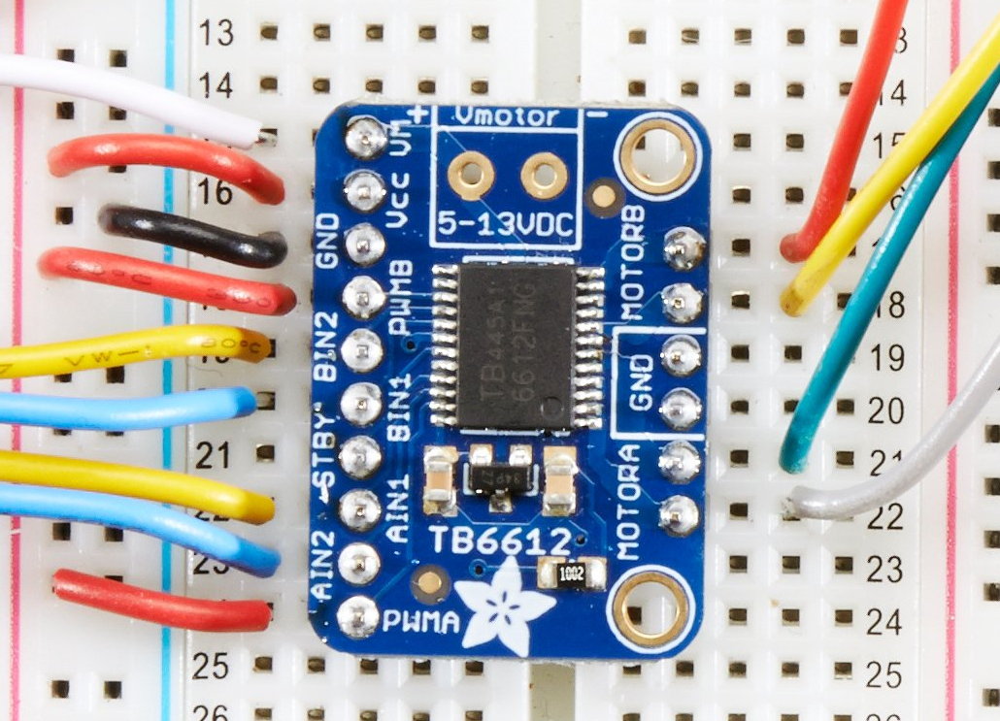

I plan to power the motor with my soldering iron power lead (+many other used lead) which is 12V 2A tip positive.

The short black power socket lead I have is also wired red to `tip positive` to red lead, so that's easy to remember.

The motor looks to be the easy part.

Does it matter if its a 9v or 12V stepper I wonder?

### Putting circuit on the pico ###

Booted pico with bootSelect held down.

Downloaded, and dropped adafruit-circuitpython-raspberry_pi_pico-en_US-6.3.0.uf2 onto device rp2

It reappears as circuitpy (E:)

I already have Mu installed (awful IDE, but handy)

I need the adafruit motor library.
Downloaded the library bundle from <https://circuitpython.org/libraries>

Copied adafruit_motor into E:\lib

```
The DRV8833 motor controller can control the two motor coils inside the stepper motor (think of it like a circular bucket brigade passing the power around A-B-A-B-A-B and so on) by receiving signals from four digital output pins on the Pico.

Wire it up as shown in the diagram here:
```

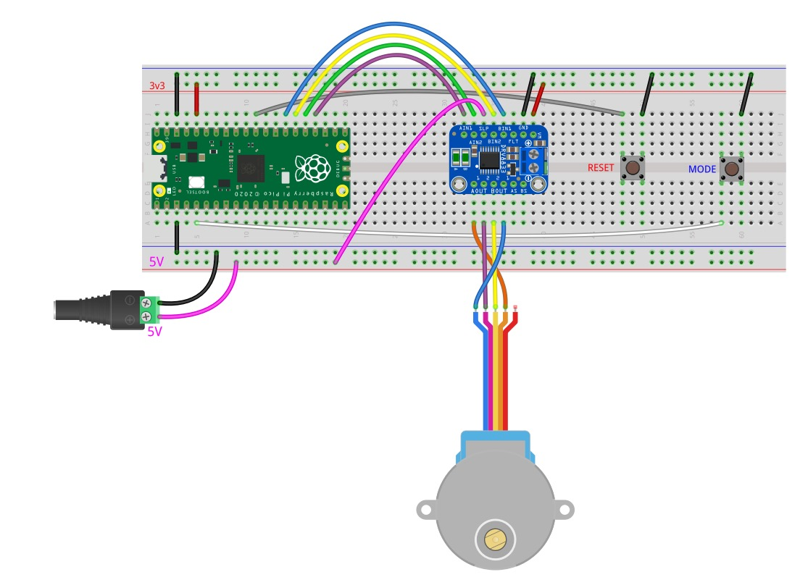

Pico

```
Pico pin 27 (GP21)  to driver pin BIN1
Pico pin 26 (GP20) to driver pin BIN2
Pico pin 25 (GP19) to driver pin AIN2
Pico pin 24 (GP18) to driver pin AIN1

Pico GND to driver GND
Pico 3v3 to driver VM
```

Nema 14 Bipolar 1.8deg 5Ncm (7.08oz.in) 0.4A 10V 35x35x20mm 4 Wires

- Ship from: Germany 14HS08-0404S

360 / 1.8 = 200 steps per revolution.

### Micro switches ###

<https://simonprickett.dev/buttons-and-leds-with-micropython-for-pi-pico/>
Pull up example allowing my to use ground pins not the poor 3.3V...

Circuit python does not support interrupts?

```
"""
Button example for Pico. Prints message to serial console when button is pressed.

REQUIRED HARDWARE:
* Button switch on pin GP13.
"""
import time
import board
import digitalio

button = digitalio.DigitalInOut(board.GP13)
button.switch_to_input(pull=digitalio.Pull.DOWN)

while True:
    if button.value:
        print("You pressed the button!")
        time.sleep(0.5)
```

I plan on using blah and blah pins for input.

#ß## Logging ###

<https://learn.adafruit.com/getting-started-with-raspberry-pi-pico-circuitpython/data-logger>

Now that I can take measurements and turn the motors, the next step is to write the values out somewhere...

```
CircuitPython does not allow your computer to write to the filesystem at the same time as CircuitPython is writing to the filesystem. Therefore, if you simply run storage.remount("/", readonly=False) in boot.py, CIRCUITPY is no longer writable by your computer, which means you cannot write to or delete files from the CIRCUITPY drive. This means you cannot modify boot.py. To return the filesystem to a state writable by your computer, you would need to run some commands in the REPL. More information on this process is available at the end of this page.
```

Remounts the given path with new parameters.

Parameters
readonly (bool) – True when the filesystem should be readonly to CircuitPython.

```
"""
boot.py file for Pico data logging example. If pin GP0 is connected to GND when
the pico starts up, make the filesystem writeable by CircuitPython.
"""
import board
import digitalio
import storage

write_pin = digitalio.DigitalInOut(board.GP0)
write_pin.direction = digitalio.Direction.INPUT
write_pin.pull = digitalio.Pull.UP

# If write pin is connected to ground on start-up, CircuitPython can write to CIRCUITPY filesystem.
if not write_pin.value:
    storage.remount("/", readonly=False)
```

```
"""
Data logging example for Pico. Logs the temperature to a file on the Pico.
"""
import time
import board
import digitalio
import microcontroller

led = digitalio.DigitalInOut(board.LED)
led.switch_to_output()

try:
    with open("/temperature.txt", "a") as datalog:
        while True:
            temp = microcontroller.cpu.temperature
            datalog.write('{0:f}\n'.format(temp))
            datalog.flush()
            led.value = not led.value
            time.sleep(1)
except OSError as e:  # Typically when the filesystem isn't writeable...
    delay = 0.5  # ...blink the LED every half second.
    if e.args[0] == 28:  # If the filesystem is full...
        delay = 0.25  # ...blink the LED faster!
    while True:
        led.value = not led.value
        time.sleep(delay)
```

to keep it still whilst I jab at it, and maybe use gravity to reduce the force require to trip the switch?

