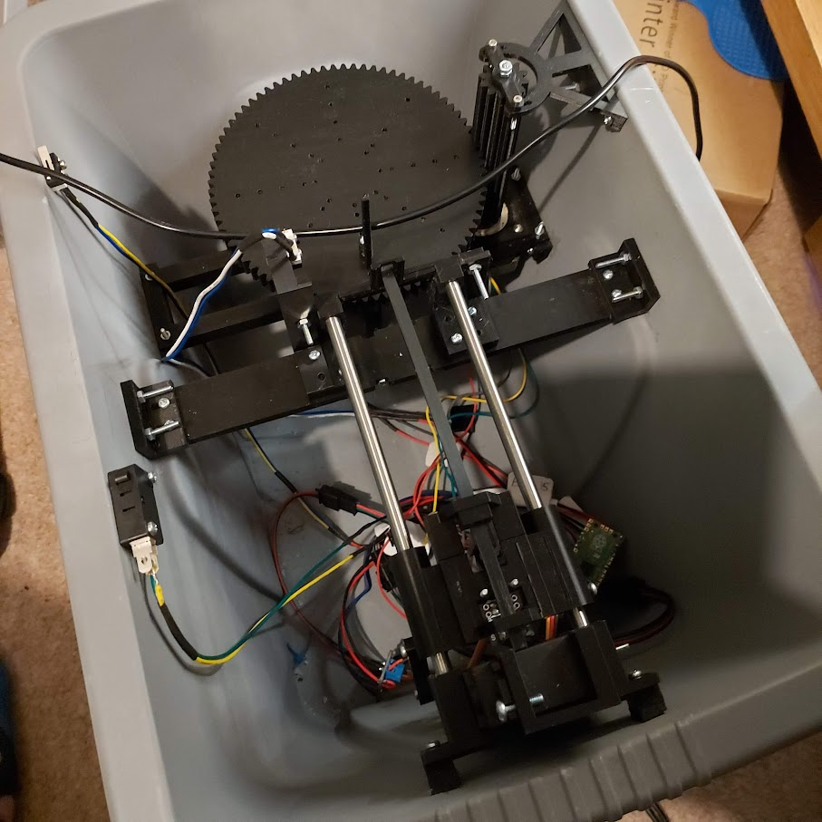
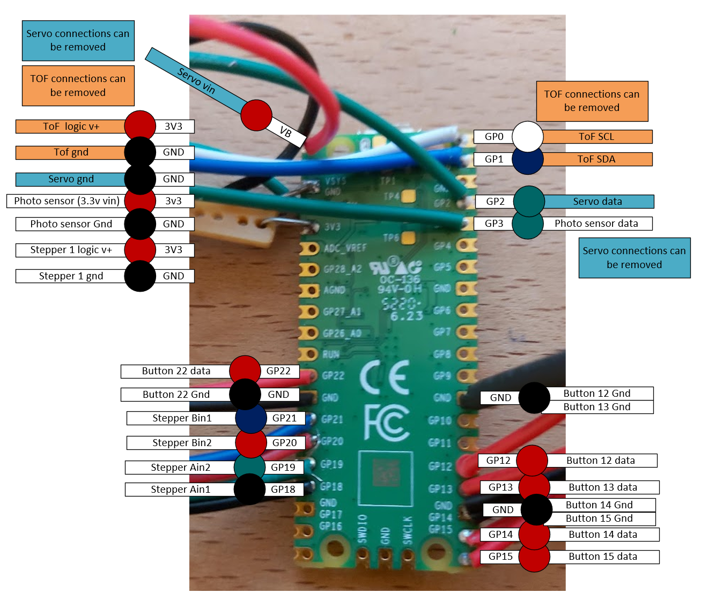
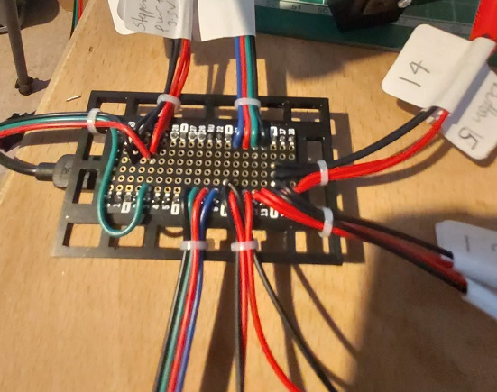
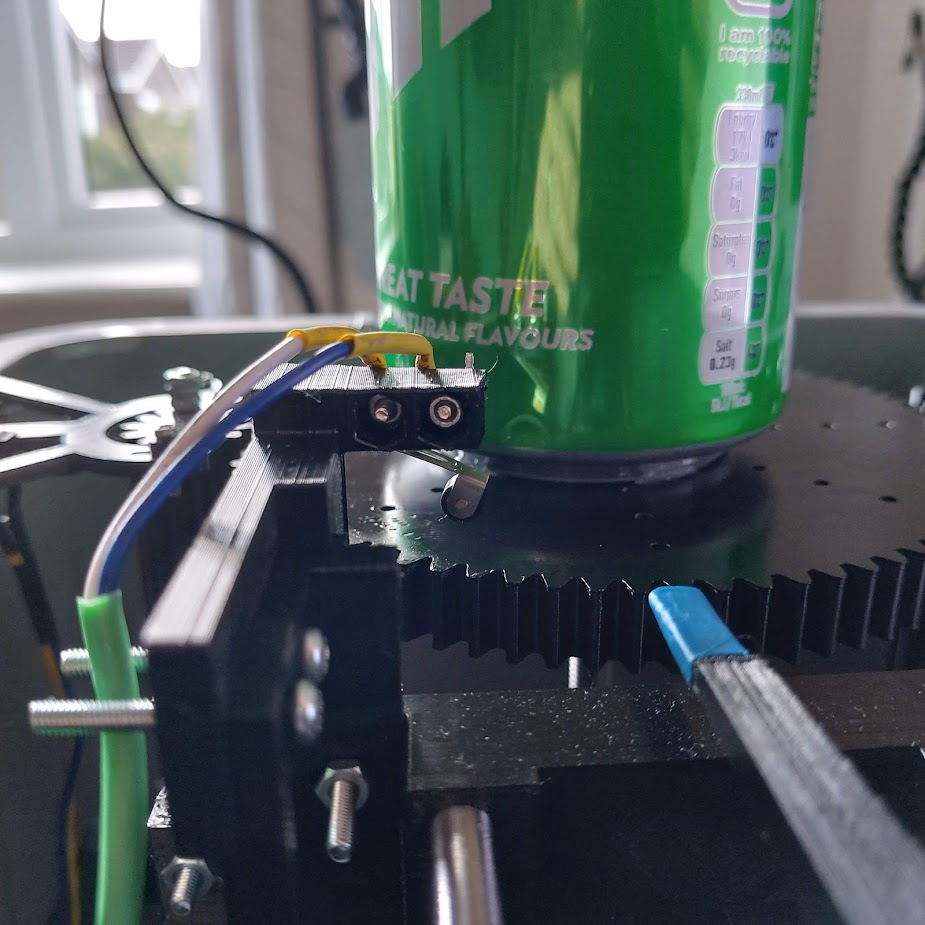
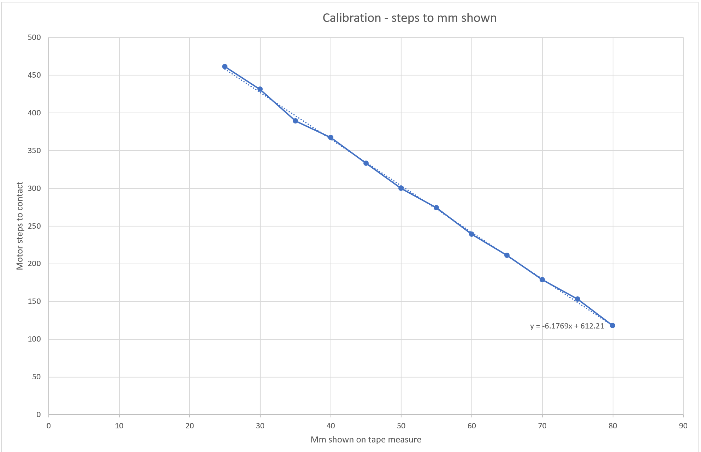

# EyeBolt #

VL53L3CX Time-Of-Flight ToF Ranging Sensor Module Breakout 3Meter 940Nm...
(Estimated delivery: Wed 15 Sep - Thu 23 Sep)

According to the VL53L0X datasheet:
> During the ranging operation, several VCSEL infrared pulses are emitted, then reflected back by the target object, and detected by the receiving array.

VCSEL is Vertical cavity surface emitting laser. Therefore I would say a pulse laser.

## VL6180X ##

VL6180X VL6180 Range Finder Optical Ranging Sensor Module for Arduino
(Estimated delivery: Wed, 08 Sep - Thu, 09 Sep)

Three-in-one smart optical module
Proximity sensor
Ambient Light Sensor
VCSEL light source
Fast, accurate distance ranging
Measures absolute range from 0 to above 10 cm (ranging beyond 10cm is dependent on conditions)
an handle about 5mm to 200mm of range distance. 

850 nm

The field or view of VL6180X is approximately ±12.5°

FOV for the IR laser used for the distance sensor is 25 degrees (+/- 12.5). This means the spot size (the area over which the sensor reads a distance) is about 0.4 times the distance from the sensor. At a distance of 50 mm, it returns a reading from some point within a 20 mm spot on the object. Good for a proximity detector, not so good if you are trying to find the edge of an object.


`Don't forget to remove the protective cover off the sensor, it may be a clear or slightly tinted plastic!`

Resolution:	1 mm2

### Connecting up ###

http://arduinolearning.com/code/arduino-and-vl6180x-module-circuitpython-example.php

https://learn.adafruit.com/adafruit-vl6180x-time-of-flight-micro-lidar-distance-sensor-breakout/pinouts

Vin - this is the power pin. Since the chip uses 2.8 VDC, we have included a voltage regulator on board that will take 3-5VDC and safely convert it down. To power the board, give it the same power as the logic level of your microcontroller - e.g. for a 5V micro like Arduino, use 5V

GND - common ground for power and logic

SCL - I2C clock pin, connect to your microcontrollers I2C clock line.
SDA - I2C data pin, connect to your microcontrollers I2C data line.


GPIO - this is a pin that is used by the sensor to indicate that data is ready. It's useful for when doing continuous sensing. 
Note there is no level shifting on this pin, you may not be able to read the 2.8V-logic-level voltage on a 5V microcontroller (we could on an arduino UNO but no promises). Our library doesn't make use of this pin but for advanced users, it's there!

I'm going to solder this up to a 5 pin connector.

And at the pico end...

To setup an I2C bus, you specify the SCL and SDA pins being used. You can look for "SCL" and "SDA" in the pin names in the pinout diagram above.

I2Cx_SCL = SCL
I2Cx_SDA = SDA
For example, here is how you would setup an I2C bus to use GP1 as SCL and GP0 as SDA:


```
import board
import busio

i2c = busio.I2C(scl=board.GP1, sda=board.GP0)

import board
import busio
import adafruit_vl6180x
i2c = busio.I2C(board.SCL, board.SDA) // Does not work on the pico
sensor = adafruit_vl6180x.VL6180X(i2c)

```

Next you'll need to install the Adafruit CircuitPython VL6180X library on your CircuitPython board.

Remember for non-express boards like the, you'll need to manually install the necessary libraries from the bundle:

adafruit_vl6180x.mpy
adafruit_bus_device
Before continuing make sure your board's lib folder or root filesystem has the adafruit_vl6180x.mpy, and adafruit_bus_device files and folders copied over.

Next connect to the board's serial REPL so you are at the CircuitPython >>> prompt.


## Steppers ##


https://thepihut.com/products/raspberry-pi-pico (3v logic)

Can it drive a nema stepper directly? Nope.

Can I use one of the 2 Adafruit motor shield v2.3 I have handy? Nope.


https://learn.adafruit.com/adafruit-feather-rp2040-pico/pinouts

Adafruit DRV8833


https://learn.adafruit.com/use-dc-stepper-servo-motor-solenoid-rp2040-pico?view=all


I've just gotten hold of one of these:

Adafruit TB6612 1.2A DC/Stepper motor Driver
http://adafru.it/2448 https://learn.adafruit.com/adafruit-tb6612-h-bridge-dc-stepper-motor-driver-breakout

Power Pins

Vmotor - This is the voltage for the motors, not for the logic level. Keep this voltage between 4.5V and 13.5V. This power supply will get noisy so if you have a system with analog readings or RF other noise-sensitive parts, you may need to keep the power supplies seperate (or filtered!)

Vcc - this is the voltage for the logic levels. Set to the voltage logic you'll be using on your microcontroller. E.g. for Arduinos, 5V is probably what you want. Can be 2.7V to 5.5V so good for 3V or 5V logic

GND - This is the shared logic and motor ground. All grounds are connected

Signal in Pins
These are all 'Vcc logic level' inputs
INA1, INA2 - these are the two inputs to the Motor A H-bridges
PWMA - this is the PWM input for the Motor A H-bridges, if you dont need PWM control, connect this to logic high.
INB1, INB2 - these are the two inputs to the Motor B H-bridges
PWMB - this is the PWM input for the Motor B H-bridges, if you dont need PWM control, connect this to logic high.
STBY - this is the standby pin for quickly disabling both motors, pulled up to Vcc thru a 10K resistor. Connect to ground to disable.

Motor Out Pins
These are 'Vmotor level' power outputs

Motor A - these are the two outputs for motor A, controlled by INA1, INA2 and PWMA
Motor B - these are the two outputs for motor B, controlled by INB1, INB2 and PWMB

https://learn.adafruit.com/adafruit-tb6612-h-bridge-dc-stepper-motor-driver-breakout/using-stepper-motors

We'll wire it to a Metro, but you can use any microcontroller you like!

Connect:

Vmotor to 12V (red wire)
Vcc to 5V (orange wire)
PWMA and PWMB to Vcc (orange wire)
GND to ground
AIN2 to Digital 4
AIN1 to Digital 5
BIN1 to Digital 6
BIN2 to Digital 7


Motor: Then hook one stepper motor coil to Motor A (red and yellow) and the second coil to Motor B (green and gray/brown). If you have another motor, you'll need to experiment a little to figure out which wires are which coil. Check any documentation you have! You can use a multimeter to measure between wires, the ones with a small resistance between them are a pair to a coil, for example. If the motor is vibrating but not spinning, check all wires are connected and try flipping around a pair or rechecking the wire pairs.

https://learn.adafruit.com/adafruit-tb6612-h-bridge-dc-stepper-motor-driver-breakout/python-circuitpython


I plan to power the motor with my soldering iron power lead (+many other used lead) which is 12V 2A tip positive.

The short black power socket lead I have is also wired red to `tip positive` to red lead, so that's easy to remember.

The motor looks to be the easy part.

Does it matter if its a 9v or 12V stepper I wonder?

# Putting circuit on the pico #

Booted pico with bootSelect held down.

Downloaded, and dropped adafruit-circuitpython-raspberry_pi_pico-en_US-6.3.0.uf2 onto device rp2

It reappears as circuitpy (E:)

I already have Mu installed (awful IDE, but handy)

I need the adafruit motor library.
Downloaded the library bundle from https://circuitpython.org/libraries

Copied adafruit_motor into E:\lib


```
The DRV8833 motor controller can control the two motor coils inside the stepper motor (think of it like a circular bucket brigade passing the power around A-B-A-B-A-B and so on) by receiving signals from four digital output pins on the Pico.

Wire it up as shown in the diagram here:
```


Pico
```
Pico pin 27 (GP21)  to driver pin BIN1
Pico pin 26 (GP20) to driver pin BIN2
Pico pin 25 (GP19) to driver pin AIN2
Pico pin 24 (GP18) to driver pin AIN1

Pico GND to driver GND
Pico 3v3 to driver VM
```
Nema 14 Bipolar 1.8deg 5Ncm (7.08oz.in) 0.4A 10V 35x35x20mm 4 Wires
  - Ship from: Germany	14HS08-0404S

360 / 1.8 = 200 steps per revolution.


## Micro switches ##

https://simonprickett.dev/buttons-and-leds-with-micropython-for-pi-pico/
Pull up example allowing my to use ground pins not the poor 3.3V...

Circuit python does not support interrupts? 

```
"""
Button example for Pico. Prints message to serial console when button is pressed.

REQUIRED HARDWARE:
* Button switch on pin GP13.
"""
import time
import board
import digitalio

button = digitalio.DigitalInOut(board.GP13)
button.switch_to_input(pull=digitalio.Pull.DOWN)

while True:
    if button.value:
        print("You pressed the button!")
        time.sleep(0.5)
```

I plan on using blah and blah pins for input.

## Logging ##

https://learn.adafruit.com/getting-started-with-raspberry-pi-pico-circuitpython/data-logger

Now that I can take measurements and turn the motors, the next step is to write the values out somewhere...

```
CircuitPython does not allow your computer to write to the filesystem at the same time as CircuitPython is writing to the filesystem. Therefore, if you simply run storage.remount("/", readonly=False) in boot.py, CIRCUITPY is no longer writable by your computer, which means you cannot write to or delete files from the CIRCUITPY drive. This means you cannot modify boot.py. To return the filesystem to a state writable by your computer, you would need to run some commands in the REPL. More information on this process is available at the end of this page.
```


Remounts the given path with new parameters.

Parameters
readonly (bool) – True when the filesystem should be readonly to CircuitPython.

```
"""
boot.py file for Pico data logging example. If pin GP0 is connected to GND when
the pico starts up, make the filesystem writeable by CircuitPython.
"""
import board
import digitalio
import storage

write_pin = digitalio.DigitalInOut(board.GP0)
write_pin.direction = digitalio.Direction.INPUT
write_pin.pull = digitalio.Pull.UP

# If write pin is connected to ground on start-up, CircuitPython can write to CIRCUITPY filesystem.
if not write_pin.value:
    storage.remount("/", readonly=False)
```

```
"""
Data logging example for Pico. Logs the temperature to a file on the Pico.
"""
import time
import board
import digitalio
import microcontroller

led = digitalio.DigitalInOut(board.LED)
led.switch_to_output()

try:
    with open("/temperature.txt", "a") as datalog:
        while True:
            temp = microcontroller.cpu.temperature
            datalog.write('{0:f}\n'.format(temp))
            datalog.flush()
            led.value = not led.value
            time.sleep(1)
except OSError as e:  # Typically when the filesystem isn't writeable...
    delay = 0.5  # ...blink the LED every half second.
    if e.args[0] == 28:  # If the filesystem is full...
        delay = 0.25  # ...blink the LED faster!
    while True:
        led.value = not led.value
        time.sleep(delay)
```

## 18th September 2021 ##

My VL53L3CX Arrived today!

With the improved detection accuracy, the sensor features a 25~3000mm sensing range, automatic smudge correction, and glass cross-talk immunity.

Typical full FoV 25°

Boo!

Got to design a different measuring,

If the radius of a circle is 70mm,
The total circumference is 440mm
100 degrees would be 
(100 / 360) * 440 = 122mm
I only need ~70mm of travel, so a standard servo should be ok with a serious fan gear

So - my thoughts.
I'm giving up on doing this optically for now - I'm going to try and make a touch sensor using a servo and a momentary switch.

I have reservations about the travel I'll need for a physical measurement.

Also, there's no reason the measured object is going to stay still.

Need something to keep it still whilst I jab at it, and maybe use gravity to reduce the force require to trip the switch?

## 21st September 2021 ##

After a few days of folly with a beautiful planetary gear train, I've rigged up some linear rail and a servo with a crank arm to move the pointer.

I now need to operate the servo.

MG 995

Signal pin (Orange pin) -The PWM signal which states the axis position is given through this pin.
VCC (Red pin) - Positive power supply for servo motor is given to this pin.
Ground(Brown pin) - This pin is connected to ground of circuit or power supply.

Operating voltage range: 4.8 V to 7.2 V
Rotational degree: 180º
Dead band width: 5 μs
Operating temperature range: 0ºC to +55ºC
Current draw at idle: 10mA
No load operating current draw: 170mA
Current at maximum load: 1200mA

https://ceilingnote.blogspot.com/2021/05/raspberry-pi-pico11-control-servo-motor.html

https://learn.adafruit.com/circuitpython-essentials/circuitpython-servo

How to list the pins:

```
import board
dir(board)
```

```import board
dir(board)
```

## 2021/09/26 ##

Going back to gear design for turntable.

http://hessmer.org/gears/InvoluteSpurGearBuilder.html?circularPitch=3.2&pressureAngle=20&clearance=0.05&backlash=0.05&profileShift=0&gear1ToothCount=0&gear1CenterHoleDiamater=4&gear2ToothCount=8&gear2CenterHoleDiamater=4&showOption=3

## 2021/09/30 ##

Push buttons have too much spring.
Can I get a photo interupter to work?
KY-10 https://arduinomodules.info/ky-010-photo-interrupter-module/

Connect the power line (middle) and ground (left) to +5V and GND respectively. Connect signal (S) to pin 3 on the Arduino.

Operating Voltage	3.3 ~ 5V

- (left)	GND
middle	+5V
S (right)	Pin 3

```
int Led = 13; // define LED pin
int buttonpin = 3; // define photo interrupter signal pin
int val; //define a numeric variable

void setup()
{
	pinMode(Led, OUTPUT); // LED pin as output
	pinMode(buttonpin, INPUT); //photo interrupter pin as input
}

void loop()
{
	val=digitalRead(buttonpin); //read the value of the sensor 
	if(val == HIGH) // turn on LED when sensor is blocked 
	{
		digitalWrite(Led,HIGH);
	}
	else
	{
		digitalWrite(Led,LOW);
	}
}
```

# Gear Ratio # 
80 : 12
360 / 1.8 = 200 steps per revolution.

200 / 12 = 16.66667
16.66667 * 80 = 1333.33

My measured estimate was 1331
Leap-step every 3 revolutions

# 12th October 2021 #



Well, my box full of robot looks pretty crazy, but it's actually functioning pretty reliably.
The latest test was to ensure that I would find the marker on the table with the measuring stick, and then perform 30 revolutions of the table, each time finding the measuring stick.

I didn't print out the measurements to check for consistency - I guess that's the next test - although the table edge and home positions seem to be working pretty reliably, so there is some hope.

44 lots of 26 steps
 6 lots of 27 steps
 1 lot of 27 + (1 if rev % 3 = 0) which adds the .3
51

360 / 51 = 

# 8th January 2022 #

Mk1 is dead! Long live Mk2!



This will the final wiring an pinout for mk1 (stepper, servo and photo sensor)

I'm trying to wire up stepper x2 and photo sensor for mk2.

# 9th January 2022 #

Stepper control board 1 is dead.

I wired up stepper control board 2 to be the same as control board 1.
I then bridged the power from the bottom of control board 1 to the input of board 2 - I think this was my mistake.

Board 1 no longer works - well, it seems to 75% work. All of the connections seem good, and it behaves the same with both the existing and the new stepper motor.

Board 2 does however work, with both motors. It behaves just fine. I even managed to drive it from two different sets of pico pins [18,19,20,21] and [6,7,8,9]

So, my best guest is that I've cooked a channel of board 1 whilst soldering on the power leads.
I have ordered a replacement, and I will unsolder and try to resolder it, to see if it can be fixed.

Generally, feels like progress.

Now I know that I can in theory drive to steppers from the pico, I can start work on the CAD anyway.

# 23rd January 2022 #

Just finished soldering up the board shield for the mk 2.

Test the individual inputs.

- Photo sensor - powered and reporting data on GP3 &#9745;
- Wired up the table top stop switch on button 10 &#9745;
- Wired up the table top stop switch on button 11 &#9745;
- Wired up the table top stop switch on button 12 &#9745;
- Wired up the table top stop switch on button 13 &#9745;
- Wired up the carriage home switch on button 14 &#9745;
- Wired up the table top stop switch on button 15 &#9745;



Added a 3d printed frame around the proto-board, which I can zip-tie bundles to for strain relief.

# 19th February 2022 #
I swapped the upper limit switch for one with a roller on, and reprinted the holder so it can run right along the edge of the toothed table.
It's a little bumpy when it contacts, but it maximises the usable area of the table.




I used the taper measure to get some calibration numbers fo the stepper motor, and it's an incredibly pleasing straight line.



In Excel, I used ctrl-e (flash fill) to automatically split the strings given a guide first row.

Now I'm going to code up a test measure of this coke can, so I can get try to get a measure of the offsets of where the measurements are taken, given an object of known size a shape.